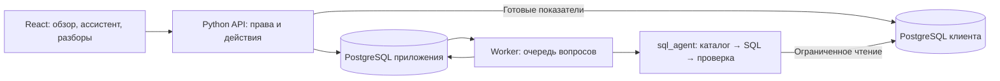

# Разбор

**Задайте вопрос о бизнесе обычными словами, получите таблицу из своей базы и разберите результат вместе с командой.**

Разбор — рабочее пространство для сети магазинов, ресторанов или франшиз. Руководителю нужно видеть, где изменились продажи и выполнение плана. Управляющему — понимать, что происходит в его точке, и отвечать на вопросы по конкретным цифрам. Аналитику — один раз определить показатели, чтобы разные сотрудники сравнивали одно и то же. Продукт объединяет эти действия: обзор сети, вопросы к данным, сохранённые расчёты и обсуждения с ответственными.

Например, руководитель замечает снижение выручки в городе и спрашивает: «Покажи выручку по точкам за сентябрь и отсортируй по убыванию». Ассистент обращается к подключённой базе и возвращает таблицу. Руководитель сохраняет результат в разбор, задаёт адресный вопрос управляющему, получает объяснение и фиксирует итог. Участники обсуждают один сохранённый расчёт; числа не меняются посреди обсуждения из-за обновления базы. После принятого действия можно измерить показатель повторно и сравнить его с исходным: новый расчёт добавляется отдельно, сохраняя прежние условия и вывод.

Модели работают локально. Нейросеть используется для построения SQL по вопросу, а роли, доступ, планы, расчёт обзора, обсуждения и уведомления реализованы обычным кодом. Для каждой такой функции не требуется отдельный AI-агент.

## Что происходит в приложении

**Обзор показывает состояние доступной части сети.** Вы выбираете показатель, точки и период. Приложение считает факт по подключённому источнику, сравнивает его с предыдущим периодом и показывает план, когда для выбранного периода задан сопоставимый план. Можно сопоставить города, перейти к точке и посмотреть динамику по дням или неделям. Если данных нет или покрытие неполное, это обозначается отдельно: отсутствие записей не превращается в нулевую выручку, а план месяца не распределяется по дням без правила.

**Ассистент отвечает на вопросы, для которых недостаточно готового обзора.** Вопрос содержит нужный результат, а не названия SQL-конструкций: «Какие точки принесли больше всего выручки?» или «А теперь только за предыдущий месяц». Диалог хранит вопросы и результаты; продолжение привязывается к выбранному предыдущему расчёту. Можно видеть ход выполнения и отменить задание. Если требуется уточнить период или показатель, ассистент возвращает уточнение вместо выдуманной таблицы.

**Результат можно проверить и сохранить.** Сначала показывается таблица; подходящие числовые данные можно представить графиком. По раскрытию доступны выполненный SQL и сведения о расчёте: источник, период и область точек. Таблицу можно выгрузить в CSV или сохранить в отчёт. Обновление отчёта создаёт отдельный результат в истории, чтобы было видно, когда и какие числа изменились. Пустой ответ, ошибка и усечённый большой результат имеют разные состояния. Денежные значения не теряют точность при передаче через JSON.

**Разбор превращает наблюдение в работу команды.** В нём есть тема, область точек, ответственный, связанный результат, комментарии и адресные вопросы. У вопроса есть конкретный адресат и отдельный ответ. Участники получают уведомления о действиях, которые требуют их внимания, и могут отобрать вопросы, ожидающие именно их ответа. Разбор завершается явным итогом; переписка и исходный расчёт остаются доступны в пределах прав участников. Для показателя сохраняется основание расчёта, включая период, определение и план. Повторное измерение доступно и после закрытия: это отдельная проверка результата принятого решения.

**Подключения и определения управляются отдельно от повседневной аналитики.** Администратор подключает PostgreSQL, проверяет соединение и разрешает конкретные таблицы и столбцы. Для таблиц с данными указывается ключ точки; общие справочники разрешаются явно. Аналитик задаёт определение показателя: источник, таблицу, поле даты, ключ точки и способ расчёта. Руководители ведут планы. Это связывает привычные бизнес-названия с реальными полями базы.

## Роли и совместная работа

У всех одна система навигации и общие правила работы с результатом. Отличаются начальная область данных и доступные действия. Сервер проверяет права при каждом обращении; скрытая кнопка не служит защитой данных.

| Участник | Основная задача | Область и действия |
| --- | --- | --- |
| Руководитель | Состояние сети и решения по отклонениям | Обзор, вопросы, отчёты, разборы и планы в разрешённой области |
| Региональный руководитель | Сопоставление и поддержка точек региона | Те же аналитические инструменты в назначенной области |
| Франчайзи | Результаты своих точек | Аналитика, вопросы, отчёты и участие в разборах |
| Управляющий точкой | Работа своей точки и ответы руководству | Аналитика своей области, ассистент и адресные вопросы |
| Аналитик | Единые определения и проверка расчётов | Настройка показателей, SQL и аналитические инструменты |
| Администратор | Подключения и участники | Управление источниками и доступом; финансовые данные требуют отдельного разрешения |

Владелец пространства управляет его настройками и участниками. Область задаётся списком точек либо доступом ко всем точкам. Дополнительно профиль источника определяет, какие таблицы и поля разрешены и кто может их читать. Например, продажи можно открыть всем участникам с доступом к данным, а расходы партнёров — только выбранным людям. Одна БД может иметь несколько таких профилей. Сохранённый результат нельзя передать участнику, которому недоступна часть его области или профиль источника. Изменение доступа учитывается и для уже сохранённой истории.

Пример завершённого сценария:

1. Аналитик задаёт показатель «Выручка» и проверяет его на контрольном расчёте.
2. Руководитель выбирает месяц и город в обзоре, затем задаёт ассистенту более подробный вопрос.
3. Из результата создаётся разбор с ответственным и областью конкретных точек.
4. Руководитель отправляет адресный вопрос управляющему. Тот открывает уведомление, видит доступный ему контекст и отвечает.
5. Участники обсуждают ответ, руководитель фиксирует итог и закрывает разбор.

AI вызывается только при новом вопросе или смысловом продолжении. Открытие страницы, комментарий, назначение ответственного, план и уведомление не запускают модель. Обновление сохранённого расчёта выполняет ранее проверенный SQL и создаёт новый результат.

## Как устроено решение

Есть три основные части: браузерный интерфейс, прикладной backend и самостоятельное SQL-ядро. Backend хранит рабочие пространства, участников и результаты в своей PostgreSQL. База клиента подключается отдельно и служит источником аналитики. Приложение не переносит всю исходную базу в модель и не создаёт в ней служебные таблицы.



Новый вопрос сохраняется как задание. Отдельный worker выбирает относящиеся к вопросу таблицы, добавляет необходимые связи и передаёт локальной модели разрешённую структуру. Грамматика ограничивает язык SQL, а проверка готового запроса контролирует конкретные таблицы, столбцы и операции. Исправимая ошибка допускает ограниченное число повторных попыток.

Перед чтением данных сервер добавляет ограничения на точки и поля во все используемые таблицы. Фильтр заданного пользователем запроса не может расширить разрешённую область. Дополнительно используется подключение только для чтения и транзакция `READ ONLY`. Перед публикацией результата права проверяются заново. Это прикладное ограничение доступа; оно не заменяет настройку отдельного пользователя чтения в PostgreSQL клиента.

Worker исполняет одну AI-задачу за раз. API продолжает обслуживать обычные действия независимо от длительной генерации, закрытие вкладки не теряет задание, а отмена передаётся до SQL-ядра. Очередь, события и результаты хранятся в БД приложения. Для этого не нужны Redis, Celery или отдельная инфраструктура сообщений.

| Каталог | Ответственность |
| --- | --- |
| [frontend](frontend/README.md) | React и TypeScript: страницы, формы, таблицы, состояния запросов и адаптивная навигация |
| [backend](backend/README.md) | FastAPI: доступ, подключения, аналитика, диалоги, работа команды и задания |
| [packages/sql_agent](packages/sql_agent/README.md) | Отдельный Python-пакет поиска, промптов, генерации и проверки SQL |
| [runtime](runtime/README.md) | Подготовка моделей, проверка файлов и создание прикладной БД |
| [tests](tests/README.md) | Проверки запуска и конфигурации; предметные тесты лежат рядом с компонентами |
| [docs](docs/README.md) | Эксплуатация, состояние проверок и история продуктовых решений |

Поддерживаются обычные аналитические SELECT: фильтры, JOIN, группировки, агрегаты, HAVING, сортировка, CASE, операции с датами и ограничение выдачи. CTE, подзапросы, оконные функции и соединение таблицы с самой собой пока исключены из языка генерации. Точная граница описана в [грамматике](packages/sql_agent/src/sql_agent/sql/grammar/README.md). Корректная форма SQL сама по себе не доказывает правильность бизнес-показателя: определение и контрольные расчёты остаются обязательной частью подключения данных.

## Запуск

Нужны Python 3.11+ и работающий Docker с Compose v2: Docker Desktop с Linux-контейнерами на Windows либо Docker Engine с Compose на Linux. Node.js и Python-библиотеки приложения устанавливаются внутри образов.

```text
python run.py
```

В Linux, где команда называется `python3`, используйте `python3 run.py`. После готовности откройте **http://localhost:8000**. Команда покажет одноразовый код первоначальной настройки: он нужен, чтобы создать первый аккаунт и пространство. Следующие участники входят по приглашениям из приложения.

Запуск собирает клиент и сервер, применяет миграции, проверяет файлы моделей и загружает недостающие. Проверенные файлы используются повторно. Прерванную подготовку можно запустить той же командой. API доступен независимо от модели; готовность AI-исполнителя проверяется отдельно.

```text
python run.py --list-models
python run.py --model qwen3.5-4b
python run.py --model qwen3.5-9b
python run.py --model qwen3.5-27b
```

Доступны три профиля **Qwen3.5** с разным расходом памяти. По умолчанию выбран 9B; 4B облегчает локальную разработку, 27B предназначен для проверки более тяжёлой модели. Размеры весов и ограничения памяти описаны в [models](models/README.md). Наличие профиля 27B не означает, что он уже проверен на ноутбуке с 24 ГБ RAM.

Для интерфейса, настройки данных и обычных действий без загрузки моделей:

```text
python run.py --without-ai
```

Новые AI-вопросы в этом режиме недоступны; история, обсуждения и обычная аналитика остаются самостоятельными функциями. Обычный запуск подготовит модели и включит worker.

```text
python run.py --stop
```

Остановка сохраняет БД, модели и секреты. Требования к внешнему PostgreSQL, настройка разрешённых адресов, размещение за HTTPS, резервное копирование и локальная разработка описаны в [руководстве эксплуатации](docs/OPERATIONS.md). Параметры и лимиты находятся в [config.yaml](config.yaml), секреты — в исключённом из Git файле `.runtime/compose.env`.

## Состояние реализации

Реализованы новый frontend, Python backend, отдельный SQL-пакет и общий сценарий запуска. Проверки отделяют поведение приложения от качества конкретной модели: HTTP-сценарии и браузер могут быть проверены без загрузки весов, а правильность реального SQL-ответа требует предметного набора данных и выбранного GGUF.

Фактически выполненные проверки и оставшиеся ограничения перечислены в [VALIDATION.md](docs/VALIDATION.md). Docker-сборка, работа на Linux и генерация с настоящими весами в текущем окружении не подтверждены запуском. Это существенная граница проверки, а не скрытое обещание готовности к публичной эксплуатации.

[Исследования](docs/research/README.md) и [макеты](docs/prototypes/README.md) сохранены как история выбора продукта. Они могут описывать более широкий замысел. Источником текущих возможностей служат этот документ, README компонентов и [контракты API](backend/API.md).
