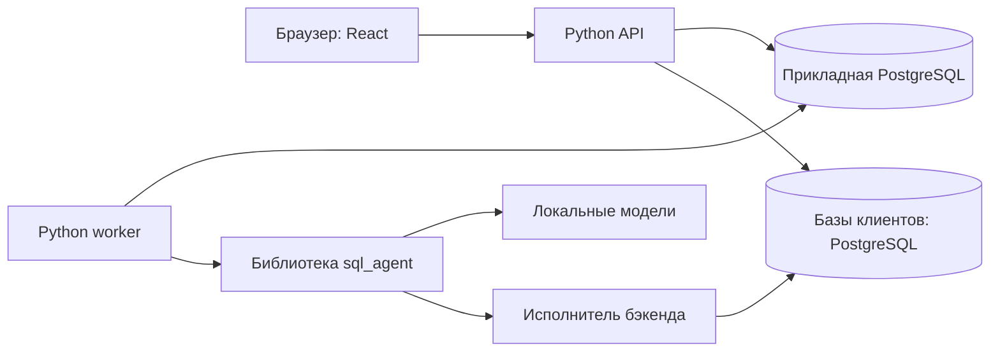

# Архитектура «Разбора»

«Разбор» соединяет аналитику сети и работу команды вокруг конкретных фактов. Пользователь смотрит показатели, задаёт вопрос обычными словами, получает таблицу и передаёт выбранный результат коллегам. Расчёт, обсуждение и принятое решение сохраняют собственное основание: новый вопрос или исправленный план не переписывает прошлые цифры.

Система разделена на веб-приложение, Python-бэкенд и независимую библиотеку SQL-агента. Такое устройство позволяет развивать интерфейс и рабочие процессы без загрузки модели, а SQL-ядро использовать отдельно от SaaS. Пользовательские сценарии и роли описаны в [PRODUCT.md](PRODUCT.md); здесь показаны технические границы и причины решений.

## 1. Процессы и данные

**API** обслуживает аккаунты, пространства, источники, обычную аналитику, историю и взаимодействие сотрудников. Он также раздаёт собранный frontend. Для нового вопроса API сохраняет задание и сразу возвращает его идентификатор; HTTP-запрос не удерживается на всё время генерации.

**Worker** загружает модели и последовательно выполняет сохранённые задания. Его состояние связано с очередью PostgreSQL, а не с открытой вкладкой пользователя. Отдельный процесс нужен, чтобы тяжёлая генерация и её память не мешали обычным запросам интерфейса.

**Прикладная PostgreSQL** хранит состояние SaaS: доступы, настройки, вопросы, результаты, планы, отчёты и обсуждения. **Базы клиентов** хранят исходные бизнес-данные. Приложение подключается к ним отдельными ролями чтения, не создаёт там пользователей или служебные таблицы и не импортирует всю базу в свою БД.

**SQL-агент** — установленный Python-пакет, не отдельный сервер. Он получает разрешённый каталог и исполнитель от бэкенда. На стороне пакета находятся поиск таблиц, промпты, грамматика, проверка SQL и исправления. У него нет собственных аккаунтов, подключений пользователя или HTTP-маршрутов.

## 2. Карта репозитория

| Каталог или файл | Ответственность |
| --- | --- |
| [backend](../backend/README.md) | Правила SaaS, API, прикладные сущности, очередь и доступ к источникам |
| [packages/sql_agent](../packages/sql_agent/README.md) | Библиотека перевода вопроса в проверенный SELECT и таблицу |
| [frontend](../frontend/README.md) | Страницы и формы пользователей, наблюдение за заданиями, отображение результатов |
| [runtime](../runtime/README.md) | Проверка конфигурации, подготовка закреплённых моделей и служебной роли БД |
| [models](../models/README.md) | Локальные веса и описание предусмотренных профилей; веса исключены из Git |
| [tools](../tools/README.md) | Резервирование и проверка собранного приложения |
| [run.py](../run.py), [Dockerfile](../Dockerfile), [docker-compose.yml](../docker-compose.yml) | Порядок запуска, образы, сервисы и тома |
| [config.yaml](../config.yaml) | Обычные настройки и каталог моделей |
| [docs](README.md) | Функционал, архитектура, разработка и эксплуатация |

Бэкенд разделён по смыслу: `access`, `sources`, `analytics`, `assistant`, `collaboration`, `jobs`, `infrastructure`. Внутри предметного модуля HTTP находится в `api/`, хранимые сущности — в `models.py`, общие операции — в `service.py`; самостоятельные большие сценарии получают собственный файл.

Frontend разделяет `app` — сессию, маршруты и оболочку, `features` — пользовательские задачи, `shared` — общие контракты, запросы и компоненты. Внутри feature используются `pages`, `components`, `hooks`, `model` по фактической ответственности. Общие UI-компоненты не должны знать бизнес-логику конкретного разбора.

Библиотека агента зависит от своих контрактов и адаптеров. Импортов бэкенда внутри неё нет. Бэкенд предоставляет библиотеке реализации портов; frontend работает с HTTP-контрактом и не импортирует Python-код.

## 3. Модель данных

| Область | Основные сущности | Что сохраняют |
| --- | --- | --- |
| Доступ | `User`, `Workspace`, `Membership`, `Session`, `Invitation` | Аккаунт, принадлежность пространству, роль, область точек, сессии и приглашения |
| Источники | `Source`, `SourceIssue`, `IssueComment` | Подключение, разрешённый каталог, читателей и технический диалог |
| Аналитика | `Store`, `Metric`, `Plan`, `Report` | Точки, версии показателей, редакции месячных планов и ссылки на сохранённые расчёты |
| Ассистент | `Conversation`, `Message`, `QueryRun` | Личный диалог, сообщения, условия запуска, SQL, ошибки и результат |
| Задания | `Job`, `RunEvent`, `WorkerHeartbeat` | Состояние очереди, аренду, последовательность событий и готовность worker |
| Совместная работа | `Case`, `Measurement`, `Comment`, `AssignedQuestion`, `Notification` | Основание разбора, повторные измерения, комментарии, адресные вопросы, итог и уведомления |
| Общие механизмы | `CreationRequest`, `AuditEvent` | Защиту создания от дублей и журнал действий |

Точный состав полей находится в [моделях бэкенда](development/backend.md) и [миграциях](../backend/migrations/README.md). Объекты предметных областей привязаны к рабочему пространству. Там, где сущности связываются друг с другом, составные внешние ключи дополнительно запрещают ссылку на объект другого пространства.

`Store.code` связывает точку приложения со значением в бизнес-источнике. Пользовательский идентификатор точки и внешний код — разные данные. Политика источника определяет колонку, по которой ограничиваются строки; изменение справочника точек не должно превращаться в произвольную подстановку SQL из браузера.

## 4. Как определяется доступ

Доступ складывается из нескольких независимых условий:

1. Аккаунт и назначение в пространстве активны.
2. Capability разрешает действие: например, `assistant:use`, `metrics:write` или `sources:manage`.
3. Для аналитического действия участнику разрешено чтение бизнес-данных, и выбранные точки входят в его область.
4. Для такого чтения профиль источника разрешён этому читателю, а нужные таблицы и поля входят в опубликованную политику.
5. Для сохранённого объекта доступны вся его область и актуальное основание доступа.

Роли задают типичный набор действий, а `data_access`, `all_stores`, `store_ids` и аудитория источника уточняют его. Владелец пространства получает административные действия, но не обход ограничений чтения источника. Технический администратор может управлять подключением, не видя финансовых таблиц.

Авторизация находится на сервере. Пункты меню и кнопки используют capabilities для понятного интерфейса, однако прямой URL, запрос API или старый курсор проходят те же проверки. Ссылка на сохранённый отчёт сама по себе не предоставляет доступ.

Членство имеет `revision`, источник — `catalog_version` для каталога и `policy_revision` для правил чтения. Изменение области пользователя или политики источника учитывается при выполнении и публикации фонового результата. Снимок прошлых прав хранит основание расчёта, но не закрепляет право читать его навсегда.

Личный разговор принадлежит автору. Публикация таблицы в отчёте или разборе не открывает коллегам весь чат. Заголовок и текст уведомления также проверяются по доступу к его цели, чтобы уведомления не стали обходом ограничений.

## 5. Основные потоки

### Подключение данных

Администратор создаёт профиль источника, задаёт роль чтения и параметры TLS. Сервер проверяет адрес по allowlist, открывает соединение и получает метаданные. Администратор выбирает таблицы, колонки, область строк и читателей. Опубликованный профиль становится входом для обычной аналитики и каталога агента.

Сетевой allowlist защищает границу подключения, роль PostgreSQL — доступ на стороне источника, профиль — допустимые данные внутри продукта. Ни один из этих механизмов не заменяет остальные. Пароль источника хранится в прикладной БД в зашифрованном виде; ключ берётся из окружения приложения.

### Обзор и карточка точки

Браузер передаёт период, показатель и точки. `analytics` проверяет область, получает определение показателя и строит SQL обычным кодом. `sources` применяет политики чтения и возвращает результат. Сервер сопоставляет факт, план, предыдущий период и возвращает готовые значения; frontend форматирует их и показывает графики.

Оба сравниваемых периода читаются одним SQL. Средние объединяются с весами, отсутствие данных отличается от нуля, месячный план не распределяется автоматически по дням. Календарные даты `timestamptz` определяются часовым поясом сессии источника. Языковая модель в этом потоке не вызывается.

### Вопрос к агенту

Браузер отправляет вопрос с источником, условиями, основанием продолжения и ключом повторной отправки. API проверяет доступ и ограничения очереди, затем одной транзакцией создаёт сообщение, запуск и задание.

Worker захватывает задание с арендой и собирает `SQLAgent`: разрешённый каталог, определения показателей, локальные модели и ограниченный исполнитель. Агент выбирает контекст, генерирует SELECT, проверяет AST и при необходимости исправляет SQL. Исполнитель применяет обязательные фильтры строк, ограничивает выдачу и использует `READ ONLY`.

Перед публикацией бэкенд повторно проверяет аренду и доступ. Только после этого таблица становится успешным сохранённым ответом. Браузер наблюдает за событиями через SSE и дополнительно запрашивает состояние. Закрытие вкладки прекращает наблюдение, а не серверный расчёт; отмена отправляется отдельной командой.

### Отчёт и повторный расчёт

Пользователь сохраняет конкретный успешный ответ. Отчёт ссылается на его SQL, период и область. Получатель должен видеть весь опубликованный результат; более узкий разбор не может прикрепить более широкую таблицу.

Обновление отчёта создаёт новое задание и выполняет сохранённый SQL по текущим правилам источника, без генерации нового запроса. История хранит все попытки. Исходный результат не заменяется результатом последнего обновления.

### Разбор и коммуникация

Разбор создаётся по штатному измерению либо выбранному SQL-результату. Автор задаёт описание, область и ответственного. Комментарии, адресные вопросы и ответы являются обычными записями приложения и вызывают внутренние уведомления.

Адресат вопроса должен иметь доступ к прикреплённой области. Закрытие сохраняет обязательный итог и прекращает обычное обсуждение. Повторное измерение использует исходное определение показателя, сохраняет новый снимок и позволяет сравнить его с первым. Закрытый разбор также допускает измерение от автора без изменения старого итога.

Техническая проблема источника оформляется отдельным обращением. Оно передаёт администратору состояние подключения и описание проблемы, без автоматической передачи финансовой таблицы и SQL-результата.

## 6. Очередь и согласованность

Очередь хранится в PostgreSQL. Захват использует `FOR UPDATE SKIP LOCKED`, а аренда получает срок и случайный токен. Продление и публикация проверяют право текущего worker на задание; поздний ответ процесса, потерявшего аренду, не становится успешным результатом.

Один диалог допускает один активный запуск. Дополнительно действуют квоты приложения, пространства и пользователя. PostgreSQL advisory lock допускает один модельный worker на прикладную БД. Увеличение числа контейнеров не является готовым способом параллельной генерации: для этого потребуется отдельное проектирование расписания и памяти.

Отмена queued-задания завершается сразу. Выполняющееся задание проходит `cancel_requested` до остановки. Потерянная аренда приводит к явной ошибке либо подтверждённой отмене; тяжёлый запрос не перезапускается автоматически без ведома пользователя.

Повторная отправка вопроса, обновления отчёта и измерения имеет собственные ключи. Создание отчёта, разбора и обращения использует общий `CreationRequest`: неизменённая операция с прежним ключом возвращает существующий объект, другой payload — конфликт. Перед повторной выдачей объект снова проверяется по текущим правам.

SSE переносит события, но источником истины остаётся состояние запуска в БД. Разрыв соединения, повтор события или повтор HTTP-ответа не должны создавать второй бизнес-объект.

## 7. Снимки и точность

Определение показателя и план имеют версии. Измерение сохраняет использованную формулу, период, точки, планы и факт. Сохранённый ответ агента содержит собственные условия, версию каталога, SQL и таблицу. Текущие фильтры страницы не меняют этот снимок.

Для SQL различаются аналитический запрос и фактически исполненный запрос с параметрами после ограничения строк. Это позволяет проверить происхождение цифр и область, в которой они рассчитаны.

Decimal передаётся JSON-строкой. Frontend форматирует денежные значения и экспортирует исходную точность; превращать все числа в JavaScript `Number` ради удобства нельзя. Графики служат представлением уже рассчитанных строк и не являются новым расчётом показателя.

`null`, отсутствие строки, настоящий ноль и `truncated` имеют разные значения. Неполный SQL-результат нельзя показывать как полную выгрузку или использовать клиентскую сортировку как рейтинг по всей базе.

## 8. Границы SQL и моделей

GBNF допускает ограниченный аналитический SELECT и только имена текущего контекста. AST-проверка связывает поля с источниками и проверяет выражения. Исполнитель отдельно проверяет текущие права, внедряет фильтры области, задаёт таймауты и использует роль PostgreSQL для чтения.

Эти уровни не доказывают правильность бизнес-формулы. JOIN способен умножить строки, неправильный период — изменить смысл сравнения. Поэтому определения показателей и контрольные вопросы с ожидаемыми результатами остаются частью разработки ядра.

Одна Qwen3.5 составляет SQL, E5 и MiniLM помогают выбрать таблицы. Готовые бизнес-сценарии не окружаются дополнительными LLM. Модели и зависимости подготовки закреплены; worker читает локальные файлы. Веса не передаются браузеру и не включаются в исходники.

## 9. Поставка и инженерные правила

Штатное развёртывание содержит постоянные `db`, `api`, `worker` и одноразовые `prepare`, `bootstrap-db`, `migrate`. Node.js нужен на этапе сборки frontend; отдельный frontend-сервер в рабочей конфигурации не требуется. Данные PostgreSQL и кеш worker размещены в разных томах, модели монтируются отдельно. Детали — в [Docker](operations/docker.md).

При развитии системы сохраняются следующие правила:

- Изменение схемы оформляется новой миграцией, включая поведение существующих записей.
- Данные разных пространств не связываются ни через ORM, ни через фоновые задания или кеш.
- Отзыв прав проверяется при исполнении, публикации и последующем чтении результата.
- Модель не получает права пользователя из промпта и не принимает решение об авторизации.
- Длительное действие сохраняется как задание; HTTP-обработчик не становится владельцем его жизненного цикла.
- Исходный результат и принятое решение не переписываются последующим пересчётом.
- Повтор пользовательского действия обрабатывается на сервере, а не только отключением кнопки.
- UI различает загрузку, пустоту, ошибку, отказ в доступе и ограниченный результат.
- Секреты, runtime-данные и результаты сборки не входят в исходники; документация описывает действующий контракт.

Практическая работа начинается с [руководства разработки](development/README.md). Для запуска, обновления, конфигурации и восстановления используется [руководство эксплуатации](operations/README.md).
