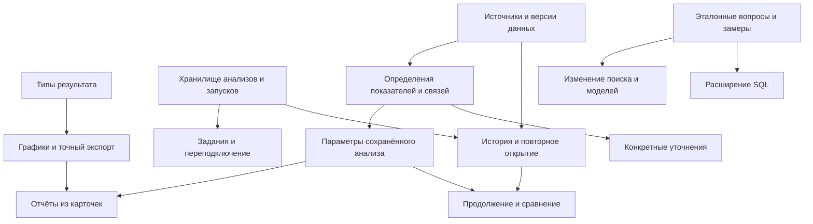

# Как развивать SQL Agent

Первоначальный отбор наиболее сильных направлений находится в [RESEARCH.md](RESEARCH.md). Продолжение [поиска новых функций](research/discovery/README.md) добавляет новые пользовательские задачи и критически сравнивает их. Этот документ сохраняет широкий каталог кандидатов и деталей; весь список не является планом ближайшего выпуска.

Исследование от 30 сентября 2026 года. Это исторические предложения и обоснования: статусы ниже относятся к моменту исследования. Часть идей реализована в новой версии «Разбора». Текущие возможности описаны в [руководстве продукта](../README_RU.md), результаты проверок — в [VALIDATION.md](VALIDATION.md).

3 октября 2026 года прежний Streamlit удалён. Наблюдения об интерфейсе ниже сохраняют исторический срез; ссылки на бывшие файлы ведут к [статусу замены](../frontend/README.md). Актуальное решение — [архитектура «Разбора»](research/franchise/architecture.md).

## Идея следующей версии

**Загрузить свои данные, спросить обычными словами, получить понятный и проверяемый ответ, а затем продолжить исследование и сохранить его.**

Например, человек загружает продажи магазина и спрашивает: «Как менялась выручка?». Приложение помогает выбрать определение выручки, показывает помесячную таблицу и график, объясняет применённые условия. Затем можно оставить только Москву, сравнить периоды и сохранить анализ. В следующем месяце достаточно обновить данные и повторить расчёт.

Такой продукт полезен и как личный инструмент, и как демонстрационный проект: его возможности складываются в законченный пользовательский сценарий. Основной ориентир этого исследования — локальный ноутбук с 24 ГБ RAM, один активный пользователь, русский язык, Windows/Linux и запуск одной командой. Командная облачная BI-платформа потребует других приоритетов.

Мой рекомендуемый курс:

1. Зафиксировать качество ответов и расход ресурсов на воспроизводимых вопросах.
2. Сделать результат самостоятельным объектом: типизированная таблица, условия расчёта, использованный SQL, история и сохранение.
3. Научить приложение понимать предметные определения и задавать конкретные уточнения.
4. Добавить удобную работу с файлами, обозреватель данных, графики и экспорт; для полноценного рабочего пространства перейти на React и TypeScript, сохранив Python API и аналитическое ядро.
5. Расширять SQL и экспериментировать с движками по результатам измерений.

## Что показал разбор текущего кода

Изучены интерфейс и HTTP-клиент, маршруты API, граф агента, промпты, поиск, метаданные, импорт, грамматика, AST-проверка, исполнение, сериализация, запуск и тесты. Предложения ниже отделяют ограничения реализации от гипотез, которые требуют измерений.

| Наблюдение | Где это видно | Следствие для развития |
| --- | --- | --- |
| Таблица, раскрываемый SQL, отмена, этапы обработки и предупреждение об усечении уже есть | [frontend/app.py](../frontend/README.md), [frontend/client.py](../frontend/README.md) | Развивать связный сценарий вокруг результата |
| Интерфейс хранит последнее задание в сессии | [frontend/app.py](../frontend/README.md) | История и сохранённые анализы требуют постоянного серверного хранилища |
| Ответ содержит названия колонок и значения, но не типы, единицы и происхождение | [domain/query.py](https://github.com/Gl12321/TP/blob/7b1c7a44285fcc88279942596c824239e442b9d1/src/domain/query.py), [routes/queries.py](https://github.com/Gl12321/TP/blob/7b1c7a44285fcc88279942596c824239e442b9d1/src/api/routes/queries.py) | Графикам, экспорту и числовой сортировке сначала нужен новый контракт результата |
| Decimal и даты передаются строками для сохранения данных | [sql/results.py](https://github.com/Gl12321/TP/blob/7b1c7a44285fcc88279942596c824239e442b9d1/src/sql/results.py) | Клиенту нужны метаданные, чтобы отличать деньги, даты и текстовые коды |
| Каталог знает PK/FK, столбцы и комментарии | [domain/schema.py](https://github.com/Gl12321/TP/blob/7b1c7a44285fcc88279942596c824239e442b9d1/src/domain/schema.py), [database/metadata.py](https://github.com/Gl12321/TP/blob/7b1c7a44285fcc88279942596c824239e442b9d1/src/database/metadata.py) | Основа обозревателя уже есть; нет определений метрик, кардинальностей и словарей значений |
| Поиск начинается с векторного сравнения целых описаний таблиц | [retriever.py](https://github.com/Gl12321/TP/blob/7b1c7a44285fcc88279942596c824239e442b9d1/src/rag/retrieval/retriever.py), [serializer.py](https://github.com/Gl12321/TP/blob/7b1c7a44285fcc88279942596c824239e442b9d1/src/rag/indexing/serializer.py) | Точные имена, редкие поля и большие таблицы стоит обрабатывать дополнительно |
| Контекст дополняется таблицами кратчайшего пути по FK; условия JOIN затем генерирует модель | [context.py](https://github.com/Gl12321/TP/blob/7b1c7a44285fcc88279942596c824239e442b9d1/src/rag/retrieval/context.py) | Топологическая близость не определяет смысл связи. Несколько FK не различаются при поиске пути, хотя сохраняются в метаданных и промпте |
| Переполнение контекста заканчивается ошибкой | [agent/graph.py](https://github.com/Gl12321/TP/blob/7b1c7a44285fcc88279942596c824239e442b9d1/src/agent/graph.py) | Нужен отбор контекста по токенам с сохранением обязательных полей и связей |
| Отказ из-за неоднозначности содержит общий совет уточнить вопрос | [agent/graph.py](https://github.com/Gl12321/TP/blob/7b1c7a44285fcc88279942596c824239e442b9d1/src/agent/graph.py) | Есть место для конкретного вопроса с вариантами и продолжением того же анализа |
| Разрыв потока отменяет запрос, завершённые задания удаляются из памяти | [routes/queries.py](https://github.com/Gl12321/TP/blob/7b1c7a44285fcc88279942596c824239e442b9d1/src/api/routes/queries.py) | Восстановление после F5 требует изменения жизненного цикла задания |
| Ошибка загрузки модели не позволяет полностью запустить API | [dependencies.py](https://github.com/Gl12321/TP/blob/7b1c7a44285fcc88279942596c824239e442b9d1/src/api/dependencies.py), [app.py](https://github.com/Gl12321/TP/blob/7b1c7a44285fcc88279942596c824239e442b9d1/src/api/app.py) | Историю и каталог желательно сделать доступными независимо от готовности генератора |
| Имя Compose-проекта зависит от абсолютного пути | [run.py](../run.py) | Перенос папки меняет имя PG-volume: прежние данные остаются, но новая команда может показать пустую базу |

У таблицы Streamlit уже есть поиск, сортировка, копирование и CSV. Добавление этих пунктов в список «новых функций» было бы неточным. Реальные расширения — типизация, понятный экспорт анализа, сохранённые настройки и связь таблицы с остальным исследованием. [Возможности st.dataframe](https://docs.streamlit.io/develop/concepts/design/dataframes).

### Проверенный пример смысловой ошибки

Пусть есть два заказа по 100 рублей. У каждого заказа две товарные позиции. Общая сумма заказов — 200 рублей.

```sql
SELECT SUM(t1."amount") AS "revenue"
FROM "sales"."orders" AS t1
JOIN "sales"."items" AS t0 ON t1."id" = t0."order_id"
```

После соединения каждый заказ встречается дважды, поэтому запрос возвращает 400. Этот SQL принят текущей грамматикой и AST-валидатором. Численный результат воспроизведён на небольшой SQLite-базе в памяти; PostgreSQL в этом эксперименте не запускался. Использованные целочисленные SUM и JOIN иллюстрируют общий механизм повторного учёта строк.

Это ограничение смысловой проверки. Запрос использует разрешённые конструкции и существующие поля, но считает показатель на неверном уровне детализации. Добавление `DISTINCT` к сумме не является общим исправлением: одинаковые суммы двух разных заказов тогда могут схлопнуться в 100. Текущий язык такой SUM DISTINCT и так не разрешает.

Для решения нужны определения показателей, уровень строки — заказ или позиция — и допустимые пути соединения. Пример похожего подхода есть в MetricFlow: типы сущностей используются для ограничения соединений, которые размножают строки. Переносить весь MetricFlow в проект для этого не обязательно. [Документация dbt о соединениях](https://docs.getdbt.com/docs/build/join-logic).

## Какие идеи полезно взять из существующих продуктов

Сравнение касается пользовательских подходов. Оно не доказывает качество этих продуктов на наших данных и не означает, что их стек следует копировать.

| Продукт или исследование | Полезный подход | Применение здесь |
| --- | --- | --- |
| [Metabase: семантические типы](https://www.metabase.com/docs/latest/data-modeling/semantic-types) | Тип и смысл поля управляют форматированием и действиями | Деньги, идентификаторы, даты и доли должны иметь разное представление |
| [Metabase: drill-through](https://www.metabase.com/docs/latest/questions/visualizations/drill-through) | Исследование данных отличается от изменения произвольного SQL | Начать с параметров анализа; переход от суммы к первичным строкам требует отдельного проектирования |
| [Hex Threads](https://learn.hex.tech/docs/explore-data/threads) | Вопрос, продолжение и проверка логики связаны в одном исследовании | Сохранять анализ и его ветки, показывать изменения условий |
| [Wren AI: моделирование](https://docs.getwren.ai/oss/guide/modeling/overview) | Структура, описания, отношения и повторно используемые вычисления объединены | Ввести компактные предметные определения вокруг существующего каталога |
| [Evidence: параметры](https://docs.evidence.dev/components/dropdown) | Параметры связывают данные и представление | Сохранённый отчёт пересчитывается при выборе периода без повторной генерации SQL |
| [Vanna: память примеров](https://vanna.ai/docs/configure) | Предыдущие пары вопрос–SQL могут помогать новым вопросам | Хранить проверенные примеры с версиями источника и метрики; не считать любое успешное выполнение правильным примером |
| [BIRD](https://bird-bench.github.io/) | Для Text-to-SQL важны содержимое БД и предметные знания | Проверять соответствие «оплачен» реальному значению status, а не только наличие колонки |
| [Spider 2.0](https://spider2-sql.github.io/) | Реальные задачи требуют работы со структурой и контекстом, оценка включает конечный результат | Сравнивать таблицы ответов и этапы ошибки, а не только текст SQL |

## Основные возможности

Оценки сложности относительные: **S** — локальная доработка; **M** — несколько связанных модулей; **L** — новый сквозной сценарий или изменение архитектурного контракта. Это не обещание срока. Приоритеты относятся к развитию локального продукта: **P0** — необходимые проверки и основа, **P1** — ближайшая законченная версия, **P2** — следующий этап, **P3** — исследования и расширение аудитории.

Для быстрого выбора: F01–F04 формируют проверяемый и сохраняемый ответ; F05–F06 повышают качество выбора контекста; F07–F10 улучшают работу с данными и представление; F11–F16 превращают разовый вопрос в исследование; F17–F19 расширяют источники и устойчивость; F20–F22 закрывают даты, проверенные примеры и тяжёлые запросы. Независимый стенд качества описан после архитектурных развилок.

### F01. Результат с понятными условиями расчёта — P1 / M

Под вопросом показывается таблица. Рядом можно увидеть, что посчитано: показатель, период, фильтры, источник, дата обновления данных и полнота выдачи. SQL остаётся доступен в раскрываемом блоке. Пользователь проверяет смысл ответа, даже если не умеет читать SQL.

Нужны типизированные колонки: стабильный ID, название, тип БД, способ передачи значения, при наличии — единица измерения и происхождение. Decimal можно по-прежнему передавать строкой, но клиент должен знать, что это число. Большие целые нельзя безусловно переводить в JavaScript Number. Название `amount` само по себе не доказывает, что сумма выражена в рублях.

Описание расчёта строится из фактически выполненного SQL и выбранных определений. Найденные для промпта таблицы и действительно использованные таблицы — разные списки. Свободный второй ответ LLM не должен быть единственным источником объяснения.

**Готовность:** Decimal сортируется численно без потери исходного значения; NULL не становится нулём; пустая таблица сохраняет типы; показаны реальные фильтры и таблицы; усечение заметно и на экране, и при экспорте. Точки изменений: [QueryResult](https://github.com/Gl12321/TP/blob/7b1c7a44285fcc88279942596c824239e442b9d1/src/domain/query.py), [сериализация](https://github.com/Gl12321/TP/blob/7b1c7a44285fcc88279942596c824239e442b9d1/src/sql/results.py), [API результата](https://github.com/Gl12321/TP/blob/7b1c7a44285fcc88279942596c824239e442b9d1/src/api/routes/queries.py).

### F02. История запусков и сохранённые анализы — P1 / M–L

Пользователь возвращается к вчерашнему ответу, открывает его по ссылке, переименовывает в «Продажи по месяцам» и сохраняет. Есть два разных действия: открыть полученную тогда таблицу и пересчитать запрос на текущих данных.

Сохраняются вопрос, SQL, выбранные источники, версия данных, определения показателей, параметры модели и краткие сведения о выполнении. История — журнал попыток; сохранённый анализ — именованный рецепт с полезными настройками. Объединять эти понятия в одну бесконечную ленту неудобно.

Начать можно с ограниченного хранения результатов и ручного сохранения важных анализов. Не требуется сразу сохранять все исходные файлы и каждую строку каждой старой базы. Если прежний снимок данных не сохранён, повторное исполнение на нём недоступно — это надо показывать явно.

**Готовность:** перезапуск приложения сохраняет анализы; новый запуск не переписывает старый результат; изменение источника видно; есть удаление и лимит хранения. Основа — небольшой [домен результата](https://github.com/Gl12321/TP/blob/7b1c7a44285fcc88279942596c824239e442b9d1/src/domain/query.py) и новое хранилище состояния приложения.

### F03. Словарь показателей и правил предметной области — P1 / M–L

«Выручка», «активный клиент» и «оплаченный заказ» получают явные определения для выбранных данных. Пользователь один раз задаёт, что считать, а затем использует привычные слова.

Минимальное определение включает название и синонимы, исходное поле или выражение, обязательные фильтры, единицу измерения, поле даты и уровень детализации. Например: сумма `orders.total`, только `status = 'paid'`, один заказ — одна запись, валюта RUB, дата оплаты. Отдельно описываются связи и случаи, когда показатель нельзя безопасно распределить по выбранной категории.

У показателя нужны допустимые разрезы и правило распределения. Сумму заказа нельзя автоматически приписывать каждой товарной категории: заказ может содержать товары разных категорий. Средние, доли и уникальные количества также не всегда допускают повторное суммирование. Неизвестная кардинальность связи остаётся неизвестной до подтверждения.

Текстовое описание полезно для модели, но утверждённые формулы следует проверять структурно либо исполнять через проверенный шаблон. Если модель изменила обязательный фильтр, приложение не должно показывать результат как расчёт утверждённой метрики. На первом этапе достаточно 5–10 проверенных показателей для одного демонстрационного набора.

**Готовность:** синонимы приводят к одинаковым ожидаемым результатам; редактор показывает формулу и область применения; изменение определения создаёт версию. На поддержанных определениях и путях соединений проходят случаи one-to-many, одинаковых сумм разных сущностей и составных ключей. Неподдержанное распределение требует уточнения или отказа. Первая версия разрешает доказанно безопасные формы; более сложная предагрегация появляется вместе с G2. Это не гарантия обнаружения всех смысловых ошибок произвольного SQL. Основа метаданных уже есть в [schema.py](https://github.com/Gl12321/TP/blob/7b1c7a44285fcc88279942596c824239e442b9d1/src/domain/schema.py).

### F04. Конкретные уточнения вместо общего отказа — P1 / L

На «Покажи выручку» приложение отвечает коротким вопросом: «По оплате или по созданным заказам?». Варианты отображаются кнопками; можно ввести своё условие. После выбора анализ продолжается, а принятое определение остаётся видно.

Не каждый вопрос требует подтверждения. Если определение уже задано или условие явно написано, лишний диалог только замедлит работу. Уточнять следует конкретную неопределённость: показатель, дату, единицу, неоднозначное значение, источник или смысл связи.

Нужно состояние ожидаемого ответа с идентификатором анализа. Во время ожидания нельзя удерживать общий доступ к модели и БД. SQL-GBNF остаётся строгой стадией; ответы с вариантами имеют отдельную проверяемую структуру. Полезно ограничить число уточнений и дать возможность отменить или изменить вопрос.

**Готовность:** SQL не выполняется до разрешения существенной неоднозначности; выбор относится к правильному анализу; повторное открытие сохраняет вопрос; явные исходные условия не спрашиваются повторно. [LangGraph interrupts](https://docs.langchain.com/oss/python/langgraph/interrupts) — возможный механизм, но хранение состояния и HTTP-протокол всё равно нужно спроектировать.

### F05. Поиск реальных значений и работа с русским языком — P1 / M

Вопрос «заказы из Питера со статусом оплачен» должен соотноситься с реальными значениями: `Санкт-Петербург`, `SPB`, `paid` или числовым кодом. Совпадение по названию колонки этого не решает.

Добавить управляемые словари категорий и ограниченный поиск значений только в подходящих полях. Для enum-подобных колонок можно хранить небольшой список значений; для длинного текста и высокой кардинальности нужен другой режим с лимитами. Значения и описания остаются данными, а не инструкциями для модели. Пользовательские коды и идентификаторы нельзя исправлять по приблизительному совпадению без объяснения.

Словарь хранит версию данных и признак полноты. Отсутствие значения в ограниченном профиле не доказывает его отсутствие в БД; при необходимости нужна отдельная точная проверка с бюджетом времени. Новая загрузка обновляет или инвалидирует словарь, даже если названия и типы столбцов не изменились.

Есть конкретная гипотеза для измерения: текущий `bge-reranker-base` заявлен как Chinese/English, тогда как BGE-M3 многоязычный. Это не доказывает плохую работу на русском, но требует сравнения: без reranker, текущий вариант и многоязычный кандидат при одинаковых вопросах. [Карточка текущего reranker](https://huggingface.co/BAAI/bge-reranker-base), [BGE-M3](https://huggingface.co/BAAI/bge-m3).

**Готовность:** проверены русские синонимы, опечатки, английские имена полей, редкие идентификаторы и неоднозначные категории; измерены полнота поиска нужных таблиц и время. Автоматическая замена модели принимается только после сравнения.

### F06. Поиск и контекст, учитывающие бюджет модели — P1 / M

Для небольшой базы не всегда нужен тяжёлый поиск по всем этапам; для широкой таблицы её полное описание может вытеснить нужные данные из контекста. Приложение должно выбирать достаточно сведений для вопроса и объяснять, если без дополнительного выбора задача не помещается.

Комбинировать точное совпадение по именам и синонимам с семантическим поиском. Отбирать не только таблицы, но и нужные поля, сохраняя ключи, связи, фильтры и поля утверждённых показателей. При нескольких связях между одними таблицами сохранять конкретный FK и его смысл — например, адрес оплаты отличается от адреса доставки.

Перед генерацией собирать контекст по фактическому числу токенов. Не обрезать произвольный конец документа: это может удалить обязательную связь. Если таблиц мало и они помещаются целиком, сравнить прямую передачу структуры с RAG. Это исследовательская оптимизация, а не правило «RAG всегда лишний».

**Готовность:** широкие таблицы и составные ключи не теряют нужных полей; индексы имеют fingerprint модели и сериализатора; стратегия сравнивается по качеству, RAM и времени. Точки: [retriever](https://github.com/Gl12321/TP/blob/7b1c7a44285fcc88279942596c824239e442b9d1/src/rag/retrieval/retriever.py), [context](https://github.com/Gl12321/TP/blob/7b1c7a44285fcc88279942596c824239e442b9d1/src/rag/retrieval/context.py), [бюджет промпта](https://github.com/Gl12321/TP/blob/7b1c7a44285fcc88279942596c824239e442b9d1/src/agent/graph.py).

### F07. Обозреватель данных и сведения об их качестве — P1 / M

Вместо списка технических схем — понятные источники: «Продажи магазина», «Поддержка», «Склад». В карточке видны таблицы, описание полей, диапазон дат, дата загрузки и состояние индекса. Можно открыть ограниченное превью и выбрать область вопроса.

Небольшой профиль показывает пропуски ключевых полей, предполагаемые дубликаты ключа, диапазоны и примеры категорий. Он помогает человеку понять данные и даёт полезный контекст генерации. Выборочные оценки должны отличаться от точных подсчётов; дорогое профилирование не должно блокировать работу после каждого открытия экрана.

Уникальность и связи, предположенные по выборке, показываются как гипотезы. Они не становятся основанием для гарантии корректной агрегации до подтверждения. Физические ограничения БД и наблюдения по выборке имеют разный статус.

Редактор описаний хранит пользовательский смысл отдельно от физических имён. Переименование карточки не меняет SQL-схему. Диаграмма связей полезна как дополнительный экран; для первого знакомства достаточно списка таблиц и понятных связей.

**Готовность:** превью имеет лимит и таймаут; источник можно описать и переименовать; индекс и данные имеют раздельные статусы; профиль привязан к версии данных. Это дополнение к каталогу, без автоматического изменения прежней политики доступа к чужим схемам.

### F08. Импорт CSV, XLSX и Parquet с предпросмотром — P1–P2 / L

Это одно из самых сильных расширений аудитории: обычная выгрузка из таблицы становится пригодной для вопросов без предварительного создания SQLite.

Для CSV нужны кодировка, разделитель, строка заголовков, десятичный знак, формат дат и типы. Для XLSX — выбор листов, диапазона и заголовков. Для Parquet — сохранение исходных типов и проверка совместимости нескольких файлов. Перед импортом пользователь видит первые строки и может оставить `00123` текстовым кодом.

Общий поток: проверить файл → предложить настройки → показать предпросмотр → импортировать пакетами → выдать отчёт. Некорректные строки нельзя молча выбрасывать. XLSX-формулы не обещаем вычислять; нужен понятный выбор между сохранённым значением и неподдерживаемым случаем.

Начать с CSV, затем XLSX, затем Parquet. Один общий контракт импорта полезнее трёх несвязанных маршрутов. PostgreSQL можно сохранить основным хранилищем. DuckDB или Polars рассматривать как инструмент обработки после проверки зависимостей и типов, а не добавлять оба автоматически. [CSV auto-detection DuckDB](https://duckdb.org/docs/current/data/csv/auto_detection), [Excel в Polars](https://docs.pola.rs/user-guide/io/excel/).

**Готовность:** локальные даты и числа, ведущие нули, пустые значения и дубликаты заголовков обработаны предсказуемо; настройки повторной загрузки сохраняются; большой файл не копируется целиком несколько раз в RAM.

### F09. Графики из того же результата — P1 / M

Помесячная выручка получает линейный график, продажи по категориям — столбцы, одиночный показатель — крупное значение. Таблица остаётся основным точным представлением. Смена визуализации и осей не вызывает модель заново.

Для начала достаточно трёх форм. Автоматический выбор предлагает подходящий вариант, пользователь может его поменять. Сумма показанных строк не всегда является итогом по всей базе; усечение должно сохраняться на графике. Отсутствующий месяц не равен нулевым продажам, а доли разных оснований нельзя складывать.

**Готовность:** график и таблица согласованы, порядок дат корректен, единицы видны, есть клавиатурное управление и текстовое представление. Нужен F01. Для React подходит ограниченный набор конфигураций ECharts; модель не генерирует произвольный JavaScript. [Доступность ECharts](https://echarts.apache.org/handbook/en/best-practices/aria/).

### F10. Экспорт, сохраняющий смысл ответа — P1 / M

Пользователь скачивает XLSX с таблицей и листом «Как получено»: вопрос, SQL, определения, фильтры, источник, время и полнота выдачи. Для открытого формата — CSV вместе с JSON-метаданными и SQL; позже можно добавить самостоятельный HTML-отчёт.

Разделить «скачать показанные строки» и «выгрузить весь результат». Второе — отдельное ограниченное задание с потоковой записью на диск, а не снятие лимита JSON-ответа. Если для экспорта запрос выполняется повторно, это новый момент чтения данных.

Excel имеет собственные ограничения точности чисел и даты; большие идентификаторы и точные Decimal иногда правильнее сохранить текстом с описанием типа. Строки, похожие на формулы, должны экспортироваться как данные. Parquet полезен для машинной обработки, но не обязателен в первом релизе.

**Готовность:** точные значения доступны без скрытого округления; усечение заметно; экспорт не зависит от открытого браузера; большие выгрузки не материализуются целиком в UI. Основа — F01 и, для длительного экспорта, задания.

### F11. Параметры сохранённого анализа — P2 / M

В отчёте «Продажи по месяцам» есть период, город и категория. Изменение параметров повторяет известный расчёт без новой генерации. На CPU это особенно ценно: пользователь получает управляемый аналитический инструмент после первого вопроса.

Параметры имеют типы, разрешённые значения и явную связь с условиями запроса. SQL нельзя менять строковой заменой. Хранится проверенный шаблон или структурированное описание поддержанного расчёта, а значения передаются отдельно и проверяются.

Шаблон проходит тот же действующий AST-валидатор и исполняется с теми же правами и лимитами. Использование CTE или окон внутри шаблона также требует соответствующего расширения проверки; статус «проверенный шаблон» не является обходом правил SQL.

**Готовность:** смена даты не меняет формулу показателя, фильтры видны, неправильный тип отклоняется, исходный результат остаётся в истории. Изменение схемы или метрики требует перепроверки рецепта. Зависимости — F01–F03.

### F12. Продолжение и ветки исследования — P2 / L

«Теперь только по Москве» создаёт следующий результат с пометкой «Добавлен фильтр: город = Москва». Можно вернуться к родительскому анализу или открыть две ветки рядом. Новый независимый вопрос задаётся явно.

Хранить следует выбранные источники, показатель, период, фильтры и связь с предыдущим запуском. Бесконечная переписка с полными таблицами быстро расходует контекст 8B/14B/27B и затрудняет понимание состояния. Последнее уточнение должно менять только обозначенную часть задачи.

**Готовность:** фильтры не пропадают незаметно, определения метрик сохраняются, два анализа не делят состояние, можно показать разницу условий до выполнения. F11 даёт удобный ограниченный вариант раньше полноценного разговорного продолжения.

### F13. Готовые аналитические приёмы — P2 / M–L

Приложение предлагает действия, подходящие данным: «Сравнить периоды», «Рейтинг категорий», «Доля в общей сумме», «Накопительный итог», «Скользящее среднее». Это расширяет пользу понятными задачами, а не только списком SQL-конструкций.

Каждый приём имеет входные требования: дата, показатель, категория, уровень детализации. Если полей не хватает, действие не предлагается. Подтверждённый шаблон может давать более предсказуемое поведение, чем свободная генерация всей сложной конструкции.

**Готовность:** у приёма есть несколько эталонных примеров с NULL, нулём и пропущенными датами; требования показаны; результат соответствует выбранной метрике. Доли и рейтинги зависят от развития грамматики и проверки вложенных областей SQL.

### F14. Сравнение результатов и переход к первичным данным — P2 / L

Сравнение отвечает на «что изменилось»: два периода, два определения выручки, две версии файла. Можно увидеть абсолютное изменение, процент и вклад категорий. Основания сравнения должны быть совместимы — одинаковые единицы, определения и сопоставимые интервалы.

Переход «Покажи заказы этой суммы» возможен только там, где известны исходные строки и условия. COUNT DISTINCT, среднее, несколько JOIN и вычисляемые показатели усложняют происхождение. Первый вариант стоит ограничить поддержанными шаблонами, а не обещать универсальный drill-down для любого SQL.

**Готовность:** изменение числа объясняется проверяемым разложением; первичные строки соответствуют выбранной группе; повторный расчёт обозначен отдельно от фильтрации уже показанной таблицы. Фраза «категория внесла наибольший вклад в падение» не превращается в утверждение о причине падения.

### F15. Короткие выводы с опорой на числа — P2 / M

После таблицы можно показать: «Максимум — март», «По сравнению с предыдущим сопоставимым периодом сумма выросла на …», «В выдаче отсутствуют два месяца». Каждое утверждение связано с конкретным вычислением и результатом.

Большую часть таких сводок можно вычислять кодом и оформлять шаблоном. Если LLM используется для формулировки, она получает проверенные факты и не выбирает числа самостоятельно. Автоматические советы о бизнес-причинах и прогнозы требуют отдельной методики и данных.

**Готовность:** каждый численный вывод воспроизводим; при усечении область утверждения ограничена; нулевой знаменатель и несопоставимые периоды обработаны явно. Эта функция не должна задерживать появление самой таблицы.

### F16. Небольшие отчёты из сохранённых карточек — P2 / M

Несколько анализов объединяются в отчёт «Итоги месяца»: таблица выручки, график динамики, лучшие категории и пользовательская заметка. У карточек есть общие параметры периода и время последнего обновления.

Начать с последовательной страницы из сохранённых карточек, без сложного конструктора сетки. Обновление выполняется ограниченной очередью, чтобы не запускать несколько LLM одновременно. Старые результаты остаются видны с датой и статусом обновления.

**Готовность:** общие параметры имеют совместимые типы, карточки не расходятся по версии метрики, отчёт можно экспортировать и открыть без работающего приложения. Нужны F02, F09–F11.

### F17. Подключение существующего PostgreSQL — P3 / L

Пользователь указывает свою БД с учётной записью только для чтения и выбирает область анализа. Копировать данные и давать административный пароль приложению не требуется.

Нынешнее устройство связывает чтение метаданных с admin-соединением, а импорт и удаление предполагают локальное хранилище. Поэтому нужен явный источник с возможностями: прочитать структуру, выполнить SELECT; операции записи доступны только там, где это предусмотрено. Начать с одного внешнего PostgreSQL, затем оценить необходимость других движков.

**Готовность:** внешний источник не требует admin-пароля, его нельзя случайно удалить через действия локального импорта, индексы разделены, учитываются права источника и изменения структуры. Это изменение [PostgresClient](https://github.com/Gl12321/TP/blob/7b1c7a44285fcc88279942596c824239e442b9d1/src/database/client.py) и слоя метаданных, а не только форма подключения.

### F18. Диагностика и управление ресурсами — P0–P1 / M

Перед тяжёлым запуском пользователь видит: модель есть, контрольная сумма проверена, доступно столько-то памяти, контейнеру выделено столько-то, диск и порты в порядке. При ошибке — конкретное действие вместо общего «не удалось запустить».

Предлагаемый режим `--doctor` собирает такой отчёт без загрузки модели. После измерений появляются профили «экономный», «сбалансированный» и «качество» с фактическими результатами на этой машине. Число ядер само по себе не определяет оптимальное число потоков. На Windows отдельно важна память WSL/Docker. [Docker и WSL](https://docs.docker.com/desktop/features/wsl/).

**Готовность:** различаются память хоста и контейнера; отчёт не содержит секретов; замеры включают RAG, генерацию и БД; смена модели не происходит молча. Качество 27B после квантования и скорость на CPU сравниваются с 8B/14B на одном наборе вопросов.

### F19. Обновление данных, перенос и резервная копия — P1–P2 / M–L

При загрузке новой версии файла показываются изменения структуры и количества строк. Пользователь выбирает замену или новую версию. Добавление строк и upsert вводятся позднее, когда можно явно выбрать ключ и поведение дубликатов.

Рабочее пространство получает стабильный ID, независимый от абсолютного пути. Перенос папки не должен незаметно переключать PostgreSQL на пустой volume. Резервная копия включает аналитические данные, историю, определения и настройки; веса достаточно описать репозиторием, версией и хешем.

При вводе нового ID нужно сохранить связь с уже существующим volume: обнаружить прежнее имя и предложить явную привязку или перенос. Простое создание нового случайного ID само по себе повторит проблему пустой базы.

**Готовность:** неудачная новая загрузка сохраняет рабочую старую; архив восстанавливается в чистом каталоге; старый анализ знает свою версию данных. Для PostgreSQL использовать dump/restore, а не копирование активного volume. Индекс можно перестроить. [pg_dump](https://www.postgresql.org/docs/16/app-pgdump.html).

### F20. Даты, периоды и часовой пояс как часть анализа — P1 / M

«Вчера», «прошлый месяц» и «последние 30 дней» должны иметь видимые границы. Для метрики важно и поле даты: создание заказа, оплата и отгрузка дают разные ответы. Часовой пояс данных может отличаться от пояса пользователя.

Сейчас промпт предлагает CURRENT_DATE, но QueryContext не хранит точку отсчёта, а исполнитель не задаёт timezone для анализа. Добавить `as_of`, выбранный часовой пояс и разрешённую роль даты. Для сохранённого результата показывать использованный интервал; для повторяемого отчёта различать фиксированные даты и относительное правило периода.

Архивная база за 2023 год не должна автоматически подменять «прошлый месяц» последним доступным месяцем. Лучше показать диапазон данных и предложить изменить вопрос. Пропущенная дата в ряду не становится нулём без явного правила.

**Готовность:** проверены границы суток между UTC и локальным временем, конец месяца и года, високосная дата; «предыдущая строка» не выдаётся за «предыдущий календарный месяц». Один сохранённый запуск имеет неизменную временную интерпретацию.

### F21. Проверенные вопросы и обратная связь — P2 / M

Пользователь отмечает конкретную проблему: показатель, фильтр, связь или данные. Вместе с замечанием сохраняются вопрос, SQL, версия источника и ожидаемое исправление. Такой случай можно воспроизвести и добавить в контрольный набор.

Отдельная библиотека содержит подтверждённые примеры, которые помогают следующим вопросам. В контекст достаточно добавлять один-два подходящих примера. Запись «запрос выполнился» и отметка «ответ понравился» не доказывают правильность чисел; продвижение в эталоны должно быть отдельным осмысленным действием.

**Готовность:** пример можно исправить и удалить; несовместимое изменение схемы исключает его из подсказок; сохранённые примеры не смешиваются с независимым набором оценки. Это способ улучшать приложение без немедленного обучения весов.

### F22. Предупреждение о тяжёлом расчёте — P2 / M

Лимит в 1000 показанных строк не ограничивает размер JOIN или сортировки внутри PostgreSQL. Для потенциально тяжёлых случаев можно после AST-проверки получить EXPLAIN без ANALYZE и показать признаки большой работы: размножение строк, большой промежуточный результат, широкая сортировка.

Оценка плана приблизительна и не является прогнозом секунд. Sequential Scan сам по себе не ошибка; маленькую таблицу часто правильно читать целиком. Такой механизм дополняет существующие таймауты и не должен молча добавлять LIMIT, меняя смысл ответа.

PostgreSQL различает оценку плана и EXPLAIN ANALYZE, который запускает запрос. Для программного разбора предусмотрен JSON; cost выражается в условных единицах. [Документация EXPLAIN](https://www.postgresql.org/docs/16/using-explain.html).

**Готовность:** предварительная оценка сама не исполняет основной запрос, имеет таймаут, не блокирует обычные небольшие выборки и даёт конкретный следующий шаг. Точные численные пороги подбираются после замеров на целевой машине.

## Фронтенд: решение и цена перехода

Для описанного рабочего пространства я рекомендую **React + TypeScript + Vite**. Причины конкретные: постоянные адреса анализов, несколько результатов на экране, ветки уточнений, связанный выбор таблицы и графика, контролируемые панели и навигация назад.

Streamlit способен показывать страницы, формы, графики и историю из серверного хранилища. Эти функции не требуют смены фреймворка сами по себе. Его модель перезапуска скрипта и привязка session_state к WebSocket делают сложное клиентское состояние менее естественным; оценка стоимости здесь относится к нашему набору сценариев. [Streamlit session_state](https://docs.streamlit.io/develop/api-reference/caching-and-state/st.session_state).

| Вариант | Подходящий сценарий | Решение |
| --- | --- | --- |
| Сохранить Streamlit | Проверить модели, метрики, простые уточнения и графики с минимумом изменений | Хорош для этапа измерения качества и ограниченного личного инструмента |
| React + TypeScript + Vite | Развивать полноценное рабочее пространство с историей и связанными представлениями | Предпочтительный вариант для целевого продукта; миграция имеет сложность L |
| NiceGUI | Сохранить разработку UI только на Python, получив более свободное событийное управление | Возможная альтернатива, но здесь промежуточная выгода не оправдывает отдельную миграцию |
| Gradio | Сделать стенд сравнения моделей и простых входов/выходов | Можно использовать отдельно для экспериментов; достаточной причины заменять им Streamlit нет |

NiceGUI использует FastAPI, Vue/Quasar и серверную обработку событий. Это не просто более красивый Streamlit и не бесплатный переход к независимому клиенту. [Официальное устройство NiceGUI](https://github.com/zauberzeug/nicegui). Gradio предоставляет Blocks и события для интерфейсов моделей; этот профиль полезнее экспериментальному стенду. [Gradio Blocks](https://github.com/gradio-app/gradio/blob/main/guides/03_building-with-blocks/01_blocks-and-event-listeners.md).

### Минимальный состав нового интерфейса

Vite собирает статические файлы, которые может отдавать существующий FastAPI. Node нужен на сборке; отдельный Node-сервер в рабочем запуске не обязателен. Это позволяет сохранить одну пользовательскую команду. [Vite production build](https://vite.dev/guide/build).

TanStack Query подходит для каталога, истории и состояния заданий. Генерация и SQL остаются явными действиями: фокус окна или повтор сетевого запроса не должны запускать дорогой расчёт второй раз. [TanStack Query](https://tanstack.com/query/latest/docs/framework/react/overview).

Для таблицы есть выбор: готовый grid или собственная разметка с TanStack Table. Последний предоставляет логику, но не готовое Excel-подобное поведение: клавиатуру, копирование, стили и доступность придётся реализовать. При 1000 строках виртуализация не является первой необходимостью. Выбор grid стоит проверить коротким прототипом на типах F01. [TanStack Table](https://tanstack.com/table/latest/docs/overview).

ECharts достаточно для ограниченного набора диаграмм. Для компонентов выбрать одну согласованную систему. На первом этапе не нужны одновременно Redux, Next.js, SSR, отдельный BFF и несколько библиотек графиков. Это оценка состава для локального приложения, а не универсальное правило для React.

### Что миграция обязана сохранить

Текущий Streamlit использует API_TOKEN в Python-процессе. Встраивать его в `VITE_API_TOKEN` нельзя: клиентские переменные попадают в сборку. Возможный вариант — один origin UI/API, локальная браузерная сессия с HttpOnly-cookie и одноразовый механизм входа от launcher; машинный Bearer API сохраняется отдельно. Нужны проверки происхождения изменяющих запросов. Учётные записи и OAuth-сервис для одного ноутбука не обязательны. [Правила Vite для переменных окружения](https://vite.dev/guide/env-and-mode.html).

Нужно перенести проверку request_id, ограничения NDJSON, heartbeat, потерю связи и явную отмену. `AbortController` закрывает клиентский запрос, но не заменяет договорённость с сервером об отмене вычисления. Переход на React сам по себе не сохраняет задания после F5.

Критерий завершения миграции — прохождение прежних сценариев, включая пустой результат, отказ, усечение, частичный импорт, отмену и сетевые ошибки. После проверки старый фронт следует убрать из рабочего пути, чтобы не поддерживать две равноправные реализации постоянно.

## Как должен выглядеть основной экран

Слева — выбранное рабочее пространство, данные, последние анализы и сохранённые отчёты. Техническое подключение находится в настройках. В центре — вопрос и карточки результатов. Для текущего анализа можно раскрыть справа условия расчёта и источники. На узком экране эти детали превращаются в выдвижную панель.

Первое открытие предлагает добавить данные или открыть демонстрационный набор. После импорта появляются подходящие примеры вопросов, основанные на реальных полях и поддерживаемых приёмах. Источник и область анализа видны до отправки вопроса.

В карточке результата основное место занимает таблица; рядом доступны график, параметры, сохранение и экспорт. Технические сведения раскрываются по запросу. Важные условия — период, показатель, полнота — остаются видимыми. Информация о модели полезна в деталях запуска, но не должна вытеснять сам результат.

Нужны спокойная типографика, выравнивание чисел, достаточный контраст, понятный focus, работа с клавиатуры и сохранение положения при обновлении. Анимация обозначает изменение состояния; проценты готовности показываются только когда существует измеримый объём работы.

## Небольшие изменения с заметной пользой

Эти доработки не требуют сразу реализовать весь целевой продукт. Часть можно сделать на нынешнем фронте; при решении мигрировать их следует включить в новый интерфейс.

| ID | Изменение | Польза и ограничение |
| --- | --- | --- |
| S01 | Убрать API URL и токен с первого плана | Обычная работа начинается с данных и вопроса; ручное подключение остаётся в настройках |
| S02 | Отображаемые названия источников | «Продажи магазина» понятнее имени файла; физические имена остаются стабильными |
| S03 | Контекстные примеры вопросов | Помогают начать; предлагаются только по существующим данным и возможностям |
| S04 | Ctrl+Enter для отправки, заметная отмена | Быстрое управление без конфликтов с вводом многострочного вопроса |
| S05 | Сохранение черновика вопроса | Случайный переход не уничтожает ввод; очистка остаётся явной |
| S06 | Повтор вопроса с редактированием | Ошибка не заставляет вводить всё заново; новый запуск получает отдельный ID |
| S07 | Действие рядом с ошибкой | «Переиндексировать источник», «Изменить модель», «Выбрать данные» вместо общего текста |
| S08 | Сохранить детали этапов из API | Сейчас клиент отбрасывает таблицы, номер попытки и причину исправления; подробности полезны для проверки |
| S09 | Отдельно время поиска, генерации и SQL | Видно, где расходуется время; проценты завершения генерации не выдумываются |
| S10 | Понятные NULL, пустые строки и длинный текст | Исключает визуальное смешение отсутствия данных, нуля и пустого значения |
| S11 | Числовые форматы и единицы | Тысячные разделители, доли и даты читаются легче; валюта берётся из определения |
| S12 | Изменение ширины, порядка и видимости колонок с сохранением | Пользователь настраивает анализ один раз; часть базового поведения таблицы уже есть |
| S13 | Разделить фильтр показанных строк и пересчёт по базе | Предотвращает неверное понимание ограниченной выдачи |
| S14 | Чёткое пояснение пустого результата | Можно предложить проверить фильтры; приложение не ослабляет их автоматически |
| S15 | Состояние «данные обновились» | Старый результат остаётся видимым и не выдаётся за текущий |
| S16 | Действия над одним источником | Удалить, заменить, переиндексировать конкретный набор; глобальные действия остаются отдельно |
| S17 | Предпросмотр замены перед импортом | Видно, какой источник затрагивается и какие анализы могут потребовать проверки |
| S18 | Поиск и избранное в истории | Полезные расчёты доступны без прокрутки всей ленты |
| S19 | Понятное локальное состояние | «Модель загружена», «Работает без сети», «Ожидает загрузки файлов» показываются по факту |
| S20 | Отчёт об ошибке без секретов | В один файл попадают версии, этап и код ошибки; SQL и данные включаются осознанно |
| S21 | Демонстрационный набор и сценарий знакомства | Новый пользователь может проверить приложение без собственной базы; демонстрационные данные явно обозначены |
| S22 | Светлая/тёмная тема и клавиатурная проверка | Улучшает ежедневную работу; важны контраст и focus, а не только переключатель цветов |

## Грамматика: что расширять и в каком порядке

Сохранить общий принцип: новый SQL принимается только после согласованного изменения языка генерации, областей видимости, проверки операций, промпта и интеграционных примеров. Добавление одного узла в allowlist недостаточно.

| Этап | Расширение | Пользовательские задачи | Основная сложность |
| --- | --- | --- | --- |
| G1 | Ограниченные числовые приведения и ROUND, выбранные строковые операции, явные правила дат | Проценты без целочисленного деления, понятное округление, нормализация значений | Допустимые типы, арифметика Decimal, проверка аргументов; уже работающие выражения не должны измениться |
| G2 | Ограниченные нерекурсивные CTE | Предварительно агрегировать позиции до уровня заказа, соединять расчёты разных уровней | Имена CTE, выходные колонки, вложенные области, ограничения глубины; запрет изменяющих данные конструкций |
| G3 | Оконные функции с узким набором | Топ-N внутри категории, доля от итога, накопительный итог, сравнение с прошлой строкой | PARTITION/ORDER/frame, отличие оконного агрегата от GROUP BY; для фильтрации рейтинга нужен внешний уровень |
| G4 | EXISTS/NOT EXISTS и ограниченные подзапросы | Несколько независимых событий без размножения основной сущности, сравнение с вычисленным набором | Коррелированные ссылки, типы и вложенные области; нужен отдельный бюджет сложности. Простые «клиенты без заказов» уже выражаются LEFT JOIN с проверкой NULL |
| G5 | Self-join и UNION ALL по подтверждённой необходимости | Сотрудник и непосредственный руководитель, две роли одной таблицы, однотипные источники | Текущая модель псевдонимов привязана к уникальной таблице; нужно менять идентичность источника. Обход иерархии произвольной глубины сюда не входит |

CTE предлагаются раньше окон потому, что многие полезные оконные расчёты нужно затем отфильтровать или соединить с другим уровнем агрегации. Это выбор порядка для проекта, а не утверждение, что окна технически невозможны без CTE. Для простого ранга одного SELECT достаточно.

Общий PostgreSQL WITH допускает также операции изменения данных — собственное подмножество должно их исключать на всех уровнях. Для окон важны рамка и порядок: LAG даёт предыдущую строку, которая при пропущенных датах может не соответствовать предыдущему месяцу. [WITH в PostgreSQL](https://www.postgresql.org/docs/16/queries-with.html), [оконные функции](https://www.postgresql.org/docs/16/functions-window.html).

Перед расширением надо собрать запросы, которые текущий язык действительно не выражает. Части базовой аналитики уже хватает CASE, условных агрегатов и арифметики; сложную конструкцию стоит добавлять ради конкретного нового сценария.

**Для каждого этапа:** положительные и отрицательные примеры → проверка GBNF → AST → исполнение на PostgreSQL → сравнение результата → проверки ограничений → промпт и документация → измерение точности и задержки модели. Поддержка полного произвольного PostgreSQL не является обязательной целью.

## Изменения архитектуры, которые поддерживают эти функции

### Состояние приложения отдельно от анализируемых таблиц

Для текущего локального продукта разумен небольшой `data/workspace.sqlite`: идентификатор пространства, источники и ревизии, определения, анализы, запуски и ограниченные результаты. Встроенный sqlite3 позволяет обойтись без нового сервиса.

Служебная схема в текущем PostgreSQL тоже возможна, но сейчас все несистемные схемы, кроме public, попадают в каталог и под глобальное удаление, а reader имеет `pg_read_all_data`. При выборе SQLite история не смешивается с анализируемыми данными и может оставаться доступной при проблеме PostgreSQL. [Поведение роли PostgreSQL](https://www.postgresql.org/docs/16/predefined-roles.html).

Существующее глобальное удаление всех несистемных схем PostgreSQL, кроме public, сохраняется. Каталог не ограничивает его только зарегистрированными или импортированными наборами. История в workspace.sqlite очищается отдельным действием; после удаления данных связанные источники помечаются отсутствующими, а сохранённые ответы остаются доступными. Будущий внешний источник только для чтения имеет отдельные возможности и не меняет смысл нынешней команды.

Цена решения — отсутствие общей транзакции SQLite и PostgreSQL. Импорт должен иметь явные состояния и восстановление после сбоя между PG commit и записью метаданных. Нельзя автоматически повторять разрушительную замену только потому, что не сохранился флаг успеха. Согласованный backup выполняется при приостановленной записи; SQLite копируется через backup API. [SQLite Backup API](https://sqlite.org/backup.html).

Начать с одного простого store, коротких транзакций и версионированной схемы. Универсальный repository framework и event sourcing здесь не нужны. Каталог продолжает получать физическую структуру из БД; workspace хранит идентичность, определения и исторические снимки.

Уже первая версия store требует последовательных миграций, отказа открывать неизвестную новую версию, резервной копии перед разрушительной миграцией и сохранения последнего завершённого состояния при ошибке записи. Полный архив PostgreSQL и пространства может появиться позже.

### Задание живёт дольше HTTP-подключения

Создание задания, его выполнение и наблюдение за ним становятся отдельными действиями. Поток передаёт события уже существующего запуска. F5 закрывает наблюдение; явная отмена меняет состояние задания и останавливает работу.

Для одной машины достаточно постоянной записи задания и одного исполнителя внутри API. Нужны ограниченная очередь, idempotency key, состояния queued/running/waiting_input/succeeded/failed/cancelled/interrupted и сохранение результата вместе с terminal state. В waiting_input вычисления и gate освобождены; ответ пользователя возобновляет нужную версию анализа. После перезапуска незавершённая генерация помечается как прерванная; обещать продолжение с того же токена не следует.

Запрос отмены хранится отдельно от итогового статуса. cancelled означает завершённое освобождение ресурсов. Отмена и фиксация готового результата разрешаются атомарным переходом состояния, чтобы поздняя отмена не уничтожила уже сохранённый ответ и success не появился после подтверждённого завершения отмены.

Текущий клиент отменяет работу при отсутствии touch в течение 45 секунд — этот механизм нужно согласованно изменить вместе с сервером. Иначе новый экран истории не решит проблему закрытия вкладки.

Существующую сериализацию тяжёлых операций сохранить: одна генерация, импорт и изменение данных не конкурируют за ресурсы. Чтение истории, диагностики и отмена не должны ждать модель. Во время пользовательского уточнения тяжёлый gate освобождается. Текущие гарантии ожидания cleanup фонового потока и SQL нужны и в новой реализации.

### Модель как управляемый ресурс

История и уже сохранённые результаты полезны даже при ошибке загрузки 27B. Состояния генератора можно отделить от готовности остального приложения: не загружен, загружается, готов, выгружается, ошибка.

Переключение на другую LLM выполняется последовательно с освобождением старой. Две большие модели одновременно на 24 ГБ не загружаются. Отдельный inference-процесс имеет смысл, если потребуется изоляция нативных падений и гарантированное освобождение памяти; новый сервер модели не обязателен для первой версии.

Загрузка модели должна быть единственной общей операцией для всех ожидающих заданий. Отмена одного ожидания не отменяет загрузку для остальных; ошибка загрузки закрывает частично созданные ресурсы и сохраняет доступность хранилища анализов.

Это затрагивает не только LLMClient, но и lifespan, healthchecks, prepare и порядок Compose. На первом этапе достаточно сохранить доступность истории при ошибке LLM. Полностью работающий интерфейс до готовности PostgreSQL и скачивания весов — более крупный следующий этап.

### Границы модулей

Существующие `agent`, `llm`, `rag`, `sql`, `database` и `api` можно сохранить. По мере появления функций добавить три понятные области: `workspace` для состояния анализов, `datasets` для жизненного цикла источников и `semantics` для предметных определений. Создавать пустые каталоги заранее не требуется.

В новом фронте достаточно групп по функциям: анализы, данные, определения; общие API-типы и UI-компоненты выделяются при реальном повторении. Отдельный файл на каждый тривиальный обработчик не улучшает архитектуру.

LangGraph сейчас управляет небольшим процессом. Его сохранение оправдано, если добавляются уточнения и возобновляемые этапы. Замена на обычный Python-цикл тоже возможна при сохранении простого сценария, но сама по себе не даёт новой пользовательской ценности. Я не предлагаю менять его одновременно с UI и состоянием заданий.

## Крупные альтернативы: что исследовать отдельно

| Решение | Возможная польза | Цена и рекомендуемая позиция |
| --- | --- | --- |
| PostgreSQL → DuckDB | Удобная локальная аналитика файлов и меньше постоянно работающей инфраструктуры | Меняются диалект, импорт, грамматика, права и ограничения. Сначала ограниченный сравнительный прототип; текущий основной движок сохранить |
| Chroma → простая матрица/лексический индекс | Более простой поиск для десятков таблиц | Нужны сравнение RAM, recall и обновления; HNSW не следует заменять без подтверждённой причины |
| Постоянный тяжёлый RAG → выбираемая стратегия | Быстрый старт и больше RAM для LLM на маленьких базах | Проверить русский язык и широкие схемы; точный поиск не заменяет смысловые синонимы |
| Встроенный llama-cpp → отдельный runtime | Изоляция падений, независимый lifecycle | Добавляет процесс и протокол; вводить при реальной потребности, сохранив текущий SQLGenerator-контракт |
| Сборка Docker при запуске → готовый релиз | Быстрее и воспроизводимее первый запуск | Нужны CI, проверенные CPU-образы и политика обновлений; это приоритетнее немедленного desktop-пакета |
| Desktop-оболочка | Иконка, единая установка, удобное управление локальными процессами | Не отменяет проблемы Python, весов и БД. Вернуться после устойчивого web-релиза и замеров Docker |

Для DuckDB особенно важно: разрешение SELECT само по себе не означает отсутствие доступа к файлам и внешним источникам. Новый исполнитель должен иметь собственную модель ограничений. Его режим записи и конкуренция также отличаются от PostgreSQL. [Безопасное использование DuckDB](https://duckdb.org/docs/current/operations_manual/securing_duckdb/overview), [конкуренция](https://duckdb.org/docs/current/connect/concurrency).

Для импорта в текущий PostgreSQL можно отдельно измерить замену пакетного INSERT на COPY и обновление статистики после загрузки. Транзакционность, Decimal, NULL и бинарные поля должны сохраниться. [Рекомендации PostgreSQL по массовой загрузке](https://www.postgresql.org/docs/16/populate.html).

## Как измерять, что проект действительно стал лучше

Текущие unit/integration-проверки полезны, но без настоящей модели они не отвечают на вопрос, правильно ли приложение считает бизнес-показатели. Нужен отдельный небольшой стенд качества.

Сначала зафиксировать минимум 40 эталонных вопросов; для развития расширить набор примерно до 100–120, распределив по сценариям. Это рекомендуемый объём работы, а не требование внешнего бенчмарка. Разделить примеры для разработки промптов и независимые проверочные вопросы.

В набор включить:

- фильтры, NULL, пустые результаты, одинаковые значения разных сущностей;
- JOIN one-to-many и many-to-many, составные и неоднозначные связи;
- даты, часовые пояса, границы месяца и относительные периоды;
- деньги, доли, целочисленное деление, округление и нулевой знаменатель;
- русские формулировки, разговорные слова, опечатки и английские имена;
- неоднозначные вопросы, ожидаемое уточнение и корректный отказ;
- широкие таблицы, отсутствующие FK и устаревшую структуру;
- усечение выдачи, отмену и нехватку ресурсов.

Сравнивать результирующие таблицы с учётом типов, повторов и порядка только там, где он значим. Совпадение SQL-строк не обязательно. Один удачный результат на одной базе тоже недостаточен: разные неверные запросы иногда случайно совпадают. Для важных показателей нужны варианты данных и инварианты — например, добавление второй позиции заказа не должно удвоить сумму самого заказа.

Результат прогона: корректность по группам задач, полнота поиска нужных таблиц, доля правильных уточнений/отказов, число исправлений, время каждого этапа и пик RAM всего приложения. Для относительных дат фиксировать дату отсчёта и timezone. Модель, квантование, контекст, промпт, каталог и версия данных записываются вместе.

Отдельно считать долю вопросов с ответом, правильность выданных ответов, необоснованные отказы на ответимых вопросах и ошибочные ответы на неответимых. Уточнение оценивается по разрешению существенной неоднозначности и правильности итоговой таблицы. Рост точности только за счёт массовых отказов не считается улучшением.

Для сравнения моделей фиксировать одинаковые данные, каталог, примеры и бюджет попыток. Отдельно сравнивать LLM при общей конфигурации и лучшие измеренные конфигурации всего приложения. Дополнительные попытки или другой reranker нельзя незаметно приписывать преимуществу новой LLM.

8B, 14B и 27B сравниваются по этому набору. Внешняя таблица рейтингов не заменяет локальный эксперимент. `llama-bench` помогает отдельно измерить prefill/decode, но не включает весь путь приложения. [Описание llama-bench](https://github.com/ggml-org/llama.cpp/blob/master/tools/llama-bench/README.md).

Обратная связь пользователя полезна как источник проверяемых случаев: «не тот показатель», «не тот фильтр», «не та связь». Автоматически превращать каждую удачную по статусу попытку в правильный обучающий пример нельзя. Сначала проверка, версия и возможность удалить пример.

## Последовательность реализации

### Этап 0. Измеримый исходный уровень

Полный запуск на целевом ноутбуке, интеграционные тесты PostgreSQL, 40 вопросов, замеры моделей и RAG. Исправить обнаруженные ошибки запуска и воспроизводимости, включая стабильную идентичность рабочего пространства. Зафиксировать исходный результат до изменения поиска и грамматики.

**Выход:** понятно, что работает, сколько памяти занимает и на каких вопросах ошибается. Сравнение будущих изменений имеет основу.

### Этап 1A. Полезный результат, к которому можно вернуться

F01, сохранение завершённых запусков из F02, минимальный F07 и экспорт показанного результата из F10. Дополнительно — узкая часть F03–F04: 5–10 проверенных показателей демонстрационного набора, известные связи и выбор между заранее определёнными трактовками. Полный редактор метрик и свободные уточнения остаются этапу 2.

Минимальная идентичность данных нужна уже здесь: dataset_id, revision_id, время импорта, хеш исходного файла и снимок структуры. Успешная замена создаёт новую ревизию, даже если прежние строки не сохраняются. Хеш структуры не доказывает неизменность строк; для внешних изменений актуальность данных может быть не подтверждена. Полные снимки и откат — отдельное расширение.

Сохранение завершённых ответов не требует сразу реализовать очередь и переподключение к активному заданию. Сначала зафиксировать контракт результата и store через существующий API, включая миграции и восстановление записи.

**Выход:** загрузил SQLite → выбрал проверенный показатель или задал вопрос → получил типизированную таблицу и условия → сохранил → перезапустил → открыл прежний ответ → экспортировал показанные строки.

### Этап 1B. Новое рабочее пространство

Рекомендуемая миграция на React, браузерный вход, адреса анализов, новый экран данных и простой график F09. Сохранить проверенные API-контракты этапа 1A. Задания, переживающие F5, оформить отдельной проверяемой частью этого этапа либо следующим небольшим выпуском; наличие истории не обещает их автоматически.

**Выход:** одна команда даёт рабочий способ открыть UI; повторное открытие и перезапуск не оставляют пользователя без входа; секрет отсутствует в bundle; посторонний origin не выполняет изменяющие запросы; машинный Bearer API продолжает работать. В браузере сохраняются прежние сценарии, включая отмену и ошибки, добавляются график, история и навигация.

В первый законченный продуктовый выпуск 1A–1B не входят CSV/XLSX, сложные окна, свободные ветки диалога и конструктор отчётов. Это ограничивает масштаб, сохраняя выразительный сценарий от вопроса до сохранённого результата.

### Этап 2. Понимание предметных определений

F03–F06 и F11, затем ограниченный F12. Добавить словарь, конкретные уточнения, поиск значений, бюджет контекста и параметры отчётов. CSV можно вести отдельным потоком, если главным источником данных являются выгрузки.

**Выход:** неоднозначная «выручка» уточняется, правила расчёта видны и повторяются, изменение периода не требует каждый раз генерировать SQL. Качество сравнивается с этапом 0.

### Этап 3. Более широкий круг задач

XLSX/Parquet, G1–G3, F13–F16, версии данных и восстановление. Каждая новая аналитическая операция добавляется вместе с эталонными примерами. Основной критерий — новые полезные задачи без ухудшения прежних.

**Выход:** можно сравнивать периоды и категории, собирать отчёт, объяснять происхождение результата и воспроизводимо обновлять данные.

### Этап 4. Проверяемые стратегические эксперименты

Внешний PostgreSQL, DuckDB, облегчённый RAG, отдельный процесс модели, desktop-пакет. Каждый эксперимент имеет собственный вопрос и измерение. Например: «Можно ли уменьшить общий расход RAM при прежнем качестве?» Решение принимается по результату, без одновременной замены всех основных технологий.

### Главные зависимости



## Что отложить

- Несколько одновременно работающих LLM-агентов на каждый вопрос. Дополнительные проходы должны доказать пользу с учётом CPU и RAM.
- Самооценку «уверенность 97%». Вместо неё показывать проверяемые факты: запрос выполнен, определение выбрано, выдача полная или ограниченная.
- Произвольный сгенерированный Python для работы с файлами. Это отдельная модель исполнения и рисков, которая не нужна для ближайших аналитических сценариев.
- Автоматическое обучение на любом успешном SQL, fine-tuning до накопления проверенных ошибок и данных.
- Полный конструктор дашбордов до сохранённых анализов и параметров.
- Автоматические причинные выводы, прогнозирование и поиск аномалий без описанной методики. Простые проверяемые сравнения полезнее на первом этапе.
- Голосовой ввод, мобильное приложение, публичные ссылки, Slack/почта и MCP до устойчивого основного сценария. У каждого может появиться польза позже, но сейчас они расширяют поверхность поддержки.
- Командные роли, SSO, облачный биллинг и расписания до появления реального многопользовательского режима. Ноутбук также не гарантирует выполнение задания во время сна.
- Redis, Celery, Kafka, отдельный Chroma-сервер и Kubernetes для одного исполнителя.
- Одновременную смену Streamlit, PostgreSQL, движка модели и оркестратора. Такой переход затруднит локализацию регрессий.

## Три сценария, которыми стоит демонстрировать проект

**Понять неизвестные данные.** Открыть демонстрационный набор → увидеть таблицы и диапазон дат → выбрать подсказанный вопрос → получить таблицу → раскрыть расчёт и SQL.

**Получить правильный показатель.** Спросить «Как менялась выручка?» → выбрать определение и период → увидеть таблицу и график → оставить один город → сравнить с исходным результатом. На специально подготовленных данных приложение избегает двойного учёта заказов.

**Сделать повторяемый отчёт.** Сохранить анализ → перезапустить приложение → открыть прежний результат → загрузить новую версию данных → пересчитать с теми же правилами → экспортировать отчёт с датой и происхождением.

Если эти сценарии выполнены последовательно, аккуратно оформлены и подтверждены проверками, проект будет выглядеть зрелым за счёт поведения и качества результата. Остальные функции можно добавлять вокруг этой основы.
