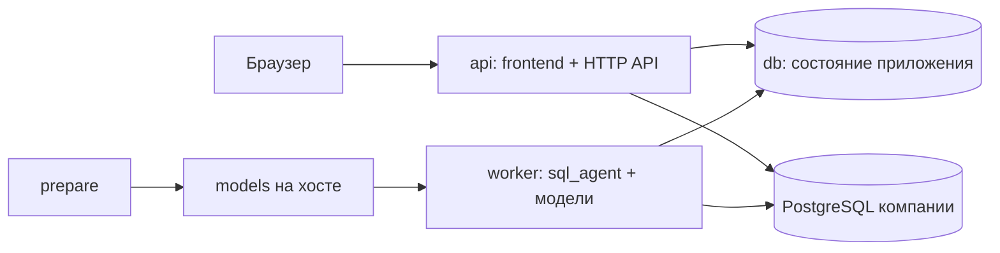

# Контейнеры и развёртывание

Контейнеры отделяют веб-приложение от тяжёлого процесса генерации и сохраняют одинаковое окружение на Windows и Linux. Frontend собирается один раз и отдаётся API. Модель живёт в worker; собственная PostgreSQL хранит пользователей, права, задания и сохранённые результаты. Подключённые базы компаний остаются отдельными источниками данных.

Конкретный состав задан в [docker-compose.yml](../../docker-compose.yml), этапы сборки — в [Dockerfile](../../Dockerfile), последовательность подготовки — в [run.py](../../run.py). Штатная команда развёртывания — `python run.py`. Она выполняет служебные этапы, которые не сводятся к одному `docker compose up`.

Установку Python, WSL 2 и Docker на новую машину выполняйте по [install.md](install.md). Здесь `python` означает уже проверенный интерпретатор. Перед сборкой выполните `run.py --check`: установленный CLI и работающий Engine — разные условия, оба нужны. Linux-образ нельзя собрать в режиме Windows-контейнеров.

## Состав установки

| Сервис | Образ или target | Время жизни и ответственность |
| --- | --- | --- |
| `db` | `postgres:16-alpine` | Постоянный PostgreSQL приложения; исходные бизнес-данные здесь автоматически не копируются |
| `api` | `api` | Постоянный FastAPI: сессии, API, права, обычные аналитические расчёты и раздача frontend |
| `worker` | `worker` | Постоянный обработчик очереди: загружает локальные модели, вызывает библиотеку `sql_agent`, выполняет обновления отчётов |
| `bootstrap-db` | `prepare` | Одноразовая подготовка прикладной БД и роли; административные реквизиты PostgreSQL нужны этому служебному процессу |
| `migrate` | `backend` | Одноразовое применение Alembic-миграций с прикладными реквизитами |
| `prepare` | `prepare` | Одноразовая проверка конфигурации, подготовка и проверка файлов моделей |

Три служебных сервиса имеют профиль `tools`; launcher вызывает их явно. После выполнения они удаляются. В полном режиме остаются три постоянных сервиса, в `--without-ai` — `db` и `api`.



Отдельный production-контейнер Node.js не требуется: Node используется на этапе сборки. Отдельного сервера модели и сетевого вызова LLM тоже нет — worker загружает библиотеку и GGUF в свой процесс. Очередь находится в PostgreSQL; Redis и Celery для этой конфигурации не нужны.

## Сборка образов

1. Этап `frontend` использует Node 24.21.0, `npm ci` по lock-файлу и `npm run build`. Результат — статический `dist`.
2. `base` использует Python 3.12 на Debian Bookworm, устанавливает небольшие зависимости подготовки и копирует `runtime` с YAML.
3. `backend` устанавливает серверные зависимости и базовый пакет `sql_agent`, копирует приложение, создаёт пользователя `app` с UID/GID 10001.
4. `api` получает `dist` и запускает Uvicorn от пользователя `app`.
5. `worker` добавляет C++-инструменты, CPU-сборку PyTorch и зависимости `sql_agent[local]`, затем работает от пользователя `app`.

Сборка worker тяжелее сборки API: `llama-cpp-python` может компилироваться. Она не выполняется в режиме `--without-ai`. Повторная сборка использует Docker cache для неизменившихся слоёв. Веса моделей не входят в образ, поэтому выбор другого профиля не требует встраивать многогигабайтный файл в контейнер.

[.dockerignore](../../.dockerignore) исключает локальные модели, данные, секреты, зависимости и результаты сборок из контекста. Содержимое `.tools` и `.runtime` не переносится в образ. Установка из репозитория не зависит от частного окружения разработчика.

## Постоянные данные

| Расположение | Что хранится | Как восстанавливается |
| --- | --- | --- |
| Том `postgres_data` | Прикладная БД: учётные записи, права, настройки источников, метрики, планы, очередь, результаты и обсуждения | Из согласованной резервной копии БД и ключа приложения |
| Том `agent_data` | Индексы описаний таблиц в `/app/data/indexes` | Перестраиваются по доступному каталогу источника |
| `./models` на хосте | Выбранные GGUF и файлы embedder/reranker | Из сохранённого каталога либо повторной подготовки закреплённых весов |
| `.runtime/compose.env` на хосте | Реквизиты приложения, PostgreSQL и код первой настройки | Из защищённой копии секретов; ключ должен соответствовать БД |
| `config.yaml` на хосте | Модели, параметры приложения, ограничения и настройки генерации | Из конфигурации данной установки |

Worker получает модели и YAML только для чтения. `prepare` имеет запись в модели. API получает YAML только для чтения и не монтирует веса. PostgreSQL не публикует свой порт на хост в стандартной конфигурации.

Остановка через `python run.py --stop` удаляет контейнеры и сеть, но сохраняет эти данные. Удаление образа отличается от удаления тома: образ пересобирается из кода, том БД содержит пользовательскую работу. Резервирование описано в [backup.md](backup.md).

## Порядок и готовность

Launcher проверяет конфигурацию до подготовки постоянных данных, затем ждёт PostgreSQL, запускает `bootstrap-db` и `migrate`, дожидается API и только после этого готовит веса и worker. Ошибка этапа останавливает дальнейшую последовательность. Повтор команды использует сохранённые данные.

Проверка `db` использует `pg_isready`. Проверка `api` обращается к `/ready`; она подтверждает доступ к служебной таблице БД. Проверка worker обращается к его CLI `--healthcheck` и состоянию heartbeat. На холодную загрузку worker предусмотрен отдельный период старта. Отсутствие heartbeat видно в HTTP health, даже когда интерфейс доступен.

API и БД имеют лимит по 768 МиБ. Для worker жёсткий `mem_limit` в Compose не задан: память определяется выбранной моделью и контролем резерва внутри агента. Лимит Docker Desktop должен вмещать всю установку; память, выделенная Docker, может быть меньше физической RAM ноутбука. На одну прикладную PostgreSQL разрешён один модельный worker: второй процесс отклоняется advisory lock до загрузки моделей. Параллельная генерация потребует изменения этого ограничения и планирования памяти, а не только увеличения числа контейнеров.

При остановке API получает до 30 секунд, worker — до 60 секунд. API и БД используют `restart: unless-stopped`, worker — ограниченный повтор при ошибке. Сама отметка `unhealthy` не означает автоматический рестарт процесса; причина проверяется по логам. Погибшее задание обрабатывается механизмом аренды очереди, а не превращается автоматически в успешный результат.

## Логи и состояние

Чтобы получить список сервисов конкретной установки, сначала посмотрите Compose-проекты:

```text
docker compose ls
```

Нужный проект имеет имя `sql-agent-<суффикс>`. Суффикс вычисляется из абсолютного пути репозитория. В следующих командах замените `PROJECT` полным именем из списка:

```text
docker compose --project-name PROJECT --env-file .runtime/compose.env -f docker-compose.yml ps
docker compose --project-name PROJECT --env-file .runtime/compose.env -f docker-compose.yml logs --tail 100 api worker db
```

При восстановленной установке вместо стандартного env-файла укажите выбранный файл. Не публикуйте вывод команд, раскрывающих конфигурацию с подставленными секретами. В диагностике обычно достаточно сервиса, времени, сообщения ошибки и идентификатора HTTP-запроса.

## Развёртывание для команды

Штатная конфигурация публикует API на `127.0.0.1:8000`. Для доступа через интернет или корпоративный домен перед приложением нужен HTTPS reverse proxy. Он может быть частью инфраструктуры сервера либо отдельным дополнительным контейнером. В репозитории описаны шесть сервисов приложения; готового сервиса выпуска сертификатов и публичного маршрутизатора в Compose нет.

Для самостоятельной публикации удобна такая топология:

| Узел | Ответственность |
| --- | --- |
| HTTPS proxy | Принимает соединения на 443, управляет сертификатами, направляет HTTP и SSE в API |
| `api` | Доступен только proxy и внутренним служебным проверкам |
| `worker` | Не имеет публичного порта; доступен PostgreSQL и разрешённые источники |
| `db` | Доступен только компонентам приложения и процедурам резервирования |

Если proxy работает на хосте, он может направлять запросы на существующий `127.0.0.1:8000`. Если proxy добавлен контейнером в ту же Compose-сеть, upstream — `api:8000`. Публиковать отдельные порты worker и БД для браузера не требуется.

Порядок подготовки публичной установки:

1. Назначьте домен, TLS-сертификат и маршрут на API. Сохраняйте исходный `Host`; для SSE отключите буферизацию ответа, задайте таймаут дольше ожидаемого запроса и не кешируйте API. Пути `/api`, `/ready` и SPA должны доходить до приложения согласно выбранной схеме маршрутизации.
2. В YAML задайте `application.secure_cookies: true` и точные HTTPS origins в `allowed_origins`. Перезапустите процессы для применения. Не оставляйте режим cookies для локального HTTP на публичном домене.
3. Ограничьте прямой доступ к API и настройте доверие к forwarded-заголовкам только от собственного proxy. Это важно и для корректного IP в ограничении попыток входа; доверие ко всем отправителям при публично доступном API недопустимо.
4. Разрешите только нужные адреса источников; настройте сетевую доступность и отдельные роли чтения на стороне PostgreSQL компании. Проверьте маршрут и от API, и от worker.
5. Сохраните секреты и резервную копию вне сервера приложения. Настройте внешний контроль доступности `/ready`, heartbeat worker, свободного диска, памяти и успешности резервирования.
6. Через публичный HTTPS-адрес проверьте первоначальную настройку или вход, изменение формы с CSRF, ограничения двух разных пользователей, SSE/отмену и восстановление контрольной копии в отдельную БД.

Proxy, мониторинг, расписание резервирования и хранение копий относятся к инфраструктуре развёртывания. Приложение предоставляет health endpoints и CLI резервирования, но не создаёт внешнее хранилище и расписание за оператора.

## Обновление и масштабирование

Обновляйте код и зависимости одной согласованной версией, предварительно создав копию. Применение миграций выполняется до запуска новой версии API. Откат кода не является откатом схемы БД: для несовместимой миграции нужен заранее подготовленный путь восстановления.

Frontend масштабируется вместе с API, поскольку это статические файлы. При росте нагрузки сначала разделяйте время запросов источника, длительность генерации и ожидание очереди. Увеличение числа HTTP-процессов не ускоряет одну генерацию и увеличивает общий лимит соединений с источниками: семафоры действуют внутри процесса. Дополнительные модельные worker сейчас блокируются на уровне прикладной PostgreSQL. Политики очереди, аренды и доступа описаны в [руководстве бэкенда](../development/backend.md), требования моделей — в [руководстве SQL-агента](../development/sql-agent.md).
