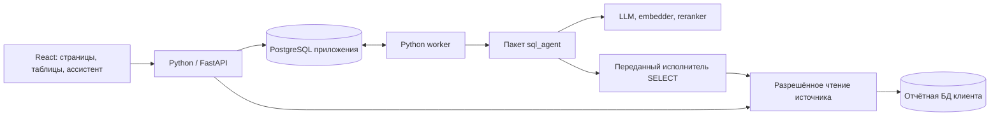

# Архитектура «Разбора»: приложение и самостоятельное SQL-ядро

Статус на 4 октября 2026 года: документ сохраняет обсуждение на этапе проектирования. Новый backend, frontend и самостоятельный SQL-пакет уже реализованы; текущее поведение и проверки описаны в [руководстве продукта](../../../README_RU.md). Утверждения о ещё не реализованных компонентах ниже относятся к первоначальной дате исследования.

Приложение должно связывать вопрос к данным, готовую таблицу и обсуждение с ответственным. При этом обычная работа — просмотр показателей, сообщения и настройки — должна оставаться доступной, пока модель выполняет тяжёлый запрос.

Проектное решение от 3 октября 2026 года: **один модульный Python-бэкенд, React-фронтенд и самостоятельный Python-пакет `sql_agent`, вызываемый фоновым исполнителем**. Это целевая архитектура; перенос текущего `src` и реализация нового приложения ещё не выполнены. Старый Streamlit удалён отдельно; переходный запуск обслуживает существующий API.

[Продукт и кейсы](README.md) · [Поведение экранов](interface.md) · [Ассистент и диалог](assistant.md).

## Состав приложения



API обслуживает пользователей, страницы и короткие штатные расчёты. Worker выполняет генерацию и индексирование, загружая модели один раз. Оба процесса используют один backend-код, конфигурацию и БД приложения. `sql_agent` не получает собственного HTTP-сервера. React собирается в статические файлы и в целевом развёртывании раздаётся с API через один origin.

У внешнего источника только согласованный профиль чтения. БД приложения хранит участников, планы, сообщения и результаты. Свободный SQL не получает доступ к прикладным таблицам с пользователями и секретами.

## Структура репозитория после переноса

```text
backend/
  pyproject.toml
  README.md
  app/
    main.py
    worker.py
    bootstrap.py
    access/
    sources/
    analytics/
    assistant/
    collaboration/
    jobs/
    infrastructure/
  migrations/
  tests/
frontend/
  package.json
  README.md
  src/
    app/
    features/
      overview/
      stores/
      assistant/
      reports/
      cases/
      data/
      settings/
    shared/
      api/
      ui/
      results/
      styles/
  tests/
packages/
  sql_agent/
    pyproject.toml
    README.md
    src/sql_agent/
      contracts.py
      ports.py
      pipeline/
      retrieval/
      generation/
      sql/
        grammar/
      adapters/
    tests/
run.py
config.yaml
docker-compose.yml
docs/
```

Это схема назначения каталогов, а не требование сейчас создать пустые файлы. В предметном модуле начинают с нужных `routes.py`, `schemas.py`, `service.py`, `models.py`; выделяют дополнительные каталоги только при появлении самостоятельной ответственности. Общий `BaseService`, универсальный repository и одинаковые слои для каждого маленького объекта не нужны. У основных каталогов свой README: назначение, поток данных, границы и ссылки на соседние части.

## Python-бэкенд

Основа сохраняется: FastAPI, Pydantic, SQLAlchemy/asyncpg и PostgreSQL; для прикладной схемы добавляются миграции Alembic. Версии фиксируются при реализации, без одновременной замены работающего SQL-стека.

| Модуль | Чем владеет | Граница |
| --- | --- | --- |
| `access` | Пользователи, сессии, пространства, членство, полномочия, области точек и полей | Выдаёт проверенный контекст доступа; имя роли не заменяет проверку |
| `sources` | Подключения, секреты, профили чтения, каталоги и версии, состояние источника | Только здесь создаются подключения; административный импорт отделён от внешней БД |
| `analytics` | Точки, версии показателей и планов, штатные расчёты, запуски, результаты, сохранённые SQL и шаблоны | Определяет финансовый смысл; работает и без модели |
| `assistant` | Личные диалоги, сообщения, выбранное основание продолжения | Создаёт запуск и компактный запрос к ядру; не хранит отдельную копию таблицы в каждом сообщении |
| `collaboration` | Разборы, участники обсуждения, адресные вопросы, итоги, уведомления | Сообщения людей не попадают в контекст LLM автоматически |
| `jobs` | Очередь, состояния, события, отмена, повтор и завершение заданий | Жизнь задания не зависит от открытой вкладки |
| `infrastructure` | Прикладные подключения, сериализация, журналирование, конфигурация | Здесь нет правил продаж, ролей или трактовки вопроса |

Маршрут проверяет вход и сессию, вызывает предметную операцию и формирует HTTP-ответ. Операция определяет права, транзакцию и переход состояния. SQLAlchemy-модели не возвращаются напрямую в браузер и не передаются в агент. Модули взаимодействуют через конкретные функции и типы; не читают чужие таблицы в обход их правил.

`bootstrap.py` собирает зависимости. API не импортирует и не создаёт тяжёлые локальные адаптеры. Worker загружает их при старте. Готовность API и готовность генерации показываются отдельно: недоступная модель блокирует новые AI-запросы, но не историю и обсуждения. Процессы Uvicorn являются отдельными процессами; поэтому загрузка модели в каждом API-процессе была бы неверной границей. [Документация FastAPI](https://fastapi.tiangolo.com/deployment/server-workers/).

## Самостоятельный пакет `sql_agent`

Пакет отвечает за **вопрос → поиск → контекст → генерация → проверка → выполнение → исправление**. Он знает PostgreSQL, структуру таблиц и ограничения результата. Он не знает пользователей продукта, франчайзи, HTTP, cookie, ORM приложения или интерфейс чата.

Исполнение остаётся этапом графа. Реальное подключение предоставляет backend через интерфейс чтения. Так ошибка PostgreSQL возвращается в существующую политику исправлений; не приходится разрывать цикл между двумя разными оркестраторами.

Три внешних интерфейса:

| Интерфейс | Что предоставляет |
| --- | --- |
| Каталог схемы | Актуальные разрешённые таблицы, поля, связи и версию метаданных; область уже определена backend |
| Генератор SQL | Подсчёт токенов и генерацию по переданной грамматике; локальный llama.cpp — текущий адаптер |
| Исполнитель чтения | SELECT в разрешённом профиле, ограниченную таблицу или нормализованную ошибку, сигнал отмены |

RAG, ранжирование и сборка грамматики остаются внутренними компонентами пакета. Адаптеры локальных моделей и векторного индекса устанавливаются с worker; их импорты не выполняются при простом импорте контрактов. Пакет не читает `.env` или глобальный YAML: он получает явные настройки.

**Вход:** вопрос, разрешённый контекст источника, версия каталога, применимые определения показателей, ограниченное основание предыдущего запуска, лимиты, отмена и обработчик событий. Полная история диалога, строки результатов, пароли и HTTP-запрос в него не входят.

**Выход:** типизированный статус, SQL при наличии, колонки с типами, строки, усечение, использованные таблицы, число попыток и код ошибки/отказа. Для чата проектируется отдельный статус уточнения. Backend добавляет `run_id`, область, время чтения, версии определений и сохранение. Время выполнения и версия каталога не выдаются за доказанную полноту или исторический снимок внешней БД.

Корректирующий `previous_sql` после ошибки и основание предыдущего диалогового ответа — разные поля. Код недостатка контекста не превращается в произвольный разговор модели: [протокол уточнений](assistant.md) расширяется отдельно, с тестами прежней грамматики.

### Что переносится из нынешнего кода

| Сейчас | Целевое место |
| --- | --- |
| [src/agent](https://github.com/Gl12321/TP/blob/7b1c7a44285fcc88279942596c824239e442b9d1/src/agent/README.md) | `sql_agent/pipeline`: граф и исправления |
| [src/rag](https://github.com/Gl12321/TP/blob/7b1c7a44285fcc88279942596c824239e442b9d1/src/rag/README.md) | `sql_agent/retrieval` и адаптер индекса |
| [src/llm](https://github.com/Gl12321/TP/blob/7b1c7a44285fcc88279942596c824239e442b9d1/src/llm/README.md) | `sql_agent/generation` и адаптер llama.cpp |
| [src/sql](https://github.com/Gl12321/TP/blob/7b1c7a44285fcc88279942596c824239e442b9d1/src/sql/README.md) | Грамматика и AST — `sql_agent/sql`; транспортная сериализация — backend |
| [src/domain](https://github.com/Gl12321/TP/blob/7b1c7a44285fcc88279942596c824239e442b9d1/src/domain/README.md) | Контракты запроса/схемы — пакет; продуктовые типы возникают отдельно в backend |
| [src/database](https://github.com/Gl12321/TP/blob/7b1c7a44285fcc88279942596c824239e442b9d1/src/database/README.md) | `backend/sources`: подключения, чтение, каталог; локальный импорт отдельным путём |
| [src/api](https://github.com/Gl12321/TP/blob/7b1c7a44285fcc88279942596c824239e442b9d1/src/api/README.md) | `backend/app`: HTTP и сборка зависимостей разделяются |
| [src/runtime](https://github.com/Gl12321/TP/blob/7b1c7a44285fcc88279942596c824239e442b9d1/src/runtime/README.md) | Подготовка окружения; загрузка весов не становится побочным эффектом импорта библиотеки |

Сначала выделяется пакет с сохранением поведения, затем добавляются источники и диалог. LangGraph, GBNF, AST и локальный движок не переписываются одновременно с перемещением. GBNF-файлы включаются в собираемый wheel; проверяется импорт установленного пакета вне репозитория. Backend объявляет зависимость от версии пакета, сборка устанавливает локально собранный wheel; в разработке допустима editable-установка. API использует лёгкий набор зависимостей, worker — дополнение с моделями и индексом. Финальная граница: `sql_agent` не импортирует `backend` или прежний `src`; backend использует только публичный контракт пакета.

## Доступ и источники

Браузерная сессия — серверная, с HttpOnly-cookie, защитой изменяющих запросов от CSRF и явной проверкой пространства. Общий `API_TOKEN` не переносится в React. Переменные `VITE_*` входят в клиентскую сборку и непригодны для секретов. [Документация Vite](https://vite.dev/guide/env-and-mode).

Каждый прикладной объект содержит пространство; составные связи не допускают ссылку на объект другого клиента. Сервер проверяет полномочия и область при запуске, чтении результата, открытии SSE, отправке сообщения и экспорте. Worker повторяет проверку перед исполнением, а переданный исполнитель — перед каждым SELECT, включая исправления. При отзыве доступа готовый результат не публикуется пользователю. Устаревший диалог не становится обходом ограничений.

Клиент выбирает желаемую область из доступных вариантов. Сервер выбирает физический профиль чтения. Для внешней БД это согласованные роли/представления с ограниченными строками и полями. Одного `WHERE`, написанного моделью, недостаточно. Если используется RLS, нужно учитывать обход политик владельцем таблицы и ролями `BYPASSRLS`; рабочему профилю эти полномочия не выдаются. [Документация PostgreSQL](https://www.postgresql.org/docs/current/ddl-rowsecurity.html).

Индекс и кэши метаданных разделяются по пространству, источнику, профилю каталога и его версии. Кэш результатов дополнительно учитывает фактическую область строк/полей, версию прав, параметры вычисления и допустимую свежесть источника: одинаковая структура таблиц не означает одинаковый доступ к точкам. Текущего ключа `schema/table` недостаточно. Метаданные читаются разрешённым подключением; операции удаления схем относятся только к локальному импорту. Новая версия индекса сначала строится отдельно, затем становится активной, чтобы выполняемый вопрос не получал половину старого каталога.

Для пилота администратор подключает один согласованный PostgreSQL-источник. Адреса и сетевой доступ ограничиваются настройкой развёртывания, а не произвольным адресом из пользовательского чата. Секреты хранятся на сервере с ключом вне прикладной БД; в ошибках, событиях и промпте их нет.

## Объекты и постоянные задания

Минимальные группы объектов: пространство и членство; источник и профиль; точка, версия показателя и плана; диалог и сообщение; запуск и результат; сохранённый отчёт и версия шаблона; разбор и адресный вопрос; уведомление; задание и событие.

`Conversation → Message → QueryRun → Result` связывает диалог с вычислением. `Report` ссылается на сохранённое вычисление; `Case` — на конкретный разрешённый снимок. Открытие старого результата ничего не пересчитывает. Полная таблица не дублируется в сообщениях и уведомлениях. В MVP чат личный; для совместной работы передаётся выбранный результат через разбор.

Очередь хранится в PostgreSQL приложения. Создание сообщения, запуска и задания выполняется одной транзакцией. У повторной отправки есть ключ идемпотентности, ограниченный пользователем, пространством и операцией; повтор с другим телом отклоняется. На один диалог допускается один активный вопрос, остальные реплики остаются черновиками до завершения или отмены.

Worker забирает задание короткой транзакцией с блокировкой, фиксирует владельца и срок исполнения, затем освобождает транзакцию. `SKIP LOCKED` пригоден для очереди, но не для чтения финансового отчёта, где пропуск заблокированных строк изменил бы результат. [Документация PostgreSQL SELECT](https://www.postgresql.org/docs/current/sql-select.html).

Состояния: `queued → running → succeeded / needs_input / failed / cancelled`; после потери исполнителя — `interrupted`. Во время генерации хранится heartbeat. Истёкшее задание не продолжается с последнего токена и не возвращается в работу незаметно: пользователь явно повторяет запуск. Публикация результата проверяет актуального владельца попытки и состояние; поздний ответ старого worker не может завершить уже отменённый запуск. Итог, ссылка из сообщения и последнее событие фиксируются атомарно.

Отмена queued-задания завершается сразу. Для работающего задания сохраняется запрос отмены, который доходит до токенизации, генерации и чтения БД. «Отменено» показывается после остановки работы и освобождения ресурса. Закрытие вкладки прекращает подписку, но не задачу. Если нативный runtime завис и не завершает отмену в установленный срок, перезапускается worker; API и сохранённые материалы остаются доступны.

В первом развёртывании одна генерация одновременно, ограниченная очередь и квоты пользователя/пространства. Короткие штатные SELECT выполняются через отдельный ограниченный пул API, не ожидая LLM. Индексирование использует тот же комплект моделей последовательно. Тяжёлые экспорты и дополнительные исполнители добавляются после измерения нагрузки. FastAPI `BackgroundTasks` не используется как постоянная очередь. [Границы фоновых задач FastAPI](https://fastapi.tiangolo.com/tutorial/background-tasks/).

## Контракт браузера и API

Будущий API версионируется префиксом `/api/v1`. Ниже группы операций, а не уже существующие endpoints:

| Операция | Контракт |
| --- | --- |
| Сессия и права | Текущий пользователь, пространства, полномочия и разрешённые области |
| Создать вопрос | `POST /conversations/{id}/messages` → `202`, `message_id`, `run_id`, `job_id` |
| Получить прогресс | `GET /jobs/{id}/events` → SSE; `GET /jobs/{id}` → текущее состояние |
| Отменить | `POST /jobs/{id}/cancel`; право проверяется по владельцу и полномочиям |
| Открыть результат | `GET /runs/{id}` и ограниченные страницы сохранённых строк |
| Повторить известный расчёт | Отдельная операция для проверенного SQL/шаблона, без генерации |
| Отправить вопрос сотруднику | Создать адресный вопрос по доступному объекту; уведомление сохраняется в той же транзакции |

У события есть `job_id`, порядковый номер, тип и краткие данные. SSE передаёт этапы и ссылку на итог, не тысячи строк таблицы. Повторное подключение использует последний номер; при истёкшей истории клиент получает актуальное состояние через GET. Heartbeat подписки не заменяет heartbeat worker. Перед выдачей событий проверяется актуальность доступа; отзыв закрывает уже открытую подписку и прекращает выдачу данных прежней области. Чтение событий не запускает вычисление. [Механика SSE](https://developer.mozilla.org/en-US/docs/Web/API/Server-sent_events/Using_server-sent_events).

Ошибка имеет код, безопасное сообщение и идентификатор запроса. Текст ошибки драйвера не отправляется в браузер и промпт без нормализации. Точные десятичные значения передаются строками; деньги рассчитываются через NUMERIC/Decimal. Валюта указывается только у известного денежного показателя, а не угадывается по типу произвольной колонки. DATE и бизнес-дата остаются датами; timestamp с зоной сохраняет смещение, без зоны — явно обозначенную семантику источника. Типы TypeScript генерируются из OpenAPI, а не поддерживаются вручную вторым набором контрактов.

Результат ограничен строками и байтами до сохранения. Пагинация сохранённого результата не означает доступ ко всем строкам исходной БД. Для усечённого результата кнопки полного экспорта нет; полный экспорт потребует отдельного задания с собственным лимитом. Графики не объявляют усечённую выборку полным итогом.

## Новый фронтенд

React + TypeScript + Vite. React Router отвечает за адреса, параметры и переходы; TanStack Query — за серверные данные и их обновление. Маршрут не заводит второй независимый кэш того же объекта. Это соответствует разделению маршрутов и server state в [React Router](https://reactrouter.com/start/data/installation) и [TanStack Query](https://tanstack.com/query/latest/docs/framework/react/overview).

`app` содержит оболочку, маршруты и провайдеры. `features` — конкретные страницы и операции предметного раздела. `shared/api` — HTTP-клиент, типы OpenAPI и поток событий; `shared/ui` — кнопки, формы, диалоги; `shared/results` — таблица, SQL и метаданные результата; `shared/styles` — токены первоначального светлого оформления. Предметный модуль не импортирует внутренние компоненты соседнего модуля.

Для таблиц — [TanStack Table](https://tanstack.com/table/latest/docs/overview) с собственным оформлением и серверной сортировкой/пагинацией там, где результат велик; он не определяет финансовую формулу. Для доступных диалогов и меню — Radix primitives с собственными стилями. Простые графики строятся из того же результата; выбор небольшой библиотеки графиков не блокирует первый табличный выпуск. Готовая тема административной панели не диктует структуру продукта.

| Состояние | Где хранится |
| --- | --- |
| Пространство, выбранная точка, период, фильтры, открытый объект | URL, с проверкой сервером |
| Отчёты, результаты, сообщения, задания и права | Backend; TanStack Query хранит временный клиентский кэш |
| Текст до отправки, открытое меню, выбранная вкладка | Локальное состояние компонента; черновик при необходимости сохраняется сервером |
| Секреты, полный список чужих точек, скрытые поля | В браузер не передаются |

При смене пространства очищаются прежние кэши, подписки и видимые данные; ключ кэша включает пользователя, пространство, область и версию прав. При выходе или отзыве доступа закрывается объект и очищается его кэш; финансовые результаты и SQL по умолчанию не сохраняются в localStorage. Обновление таблицы не заменяет заголовок старого результата текстом нового черновика. При переходе назад восстанавливаются фильтры и позиция.

Основная навигация: **Обзор, Точки, Ассистент, Отчёты, Разборы, Данные**; команда и подключения доступны через настройки по полномочиям. Ассистент имеет полноценную страницу и контекстную панель из точки/отчёта; обе используют одни компоненты, диалог и серверное состояние.

Маршруты располагаются под `/w/:workspaceId/`: `overview`, `stores/:storeId`, `assistant/:conversationId`, `reports/:reportId`, `cases/:caseId`, `data` и `settings`. Коллекции имеют собственные страницы без идентификатора; прямые ссылки повторно проверяют доступ. Страница результата не зависит от существования открытой панели ассистента.

Старт руководителя — сеть и существенные отклонения; регионального менеджера — портфель и ожидаемые ответы; франчайзи — свои точки; управляющего — своя точка, входящие и создание собственного разбора; аналитика — отчёты, определения и проблемы данных; администратора — доступы и подключения. Это общий интерфейс с разным первым экраном, а не шесть копий приложения.

## Этапы внедрения и критерии

1. **Убрать старый UI.** Удалить Streamlit и его сборку, обновить launcher и документацию. Переходный режим — существующий API; HTML-макеты остаются материалами проектирования.
2. **Выделить `sql_agent`.** Сохранить текущие сценарии и тесты, установить пакет из wheel в чистую среду без `src`, проверить включение GBNF. Обновить импорты; временные совместимые импорты удалить по окончании переноса.
3. **Создать прикладной backend.** Миграции, сессии, пространства, профили источника, постоянные задания и результаты. До UI проверить отсутствие чужих данных во всех ответах и сохранённых объектах.
4. **Собрать новый фронт и штатную аналитику.** Вход, области, обзор, точка, план/факт, состояния ошибок. Сверить суммы с контрольным источником.
5. **Добавить ассистента и разборы.** История, продолжения, таблица/SQL, вопрос сотруднику, ответ и итог. Проверить отмену, переподключение, смену прав, двойную отправку и два окна браузера.
6. **Вернуть полный запуск одной командой.** `python run.py --model ...` готовит модели и запускает новый UI, API, worker и PostgreSQL. Node нужен на этапе сборки образа, а не как дополнительная установка пользователю.

Основные проверки: грамматика/AST и результаты агента; изоляция двух пространств и областей; контрольные бизнес-расчёты; восстановление задания после обрыва; ограничения памяти и очереди; пользовательские пути в браузере на телефоне и настольном экране. Упаковка и перенос не считаются проверкой качества конкретной модели.

Новые backend/front/package здесь спроектированы, но не реализованы. Перенос ядра, запуск новой инфраструктуры и загрузка моделей не входят в выполненную подготовку этого документа.
